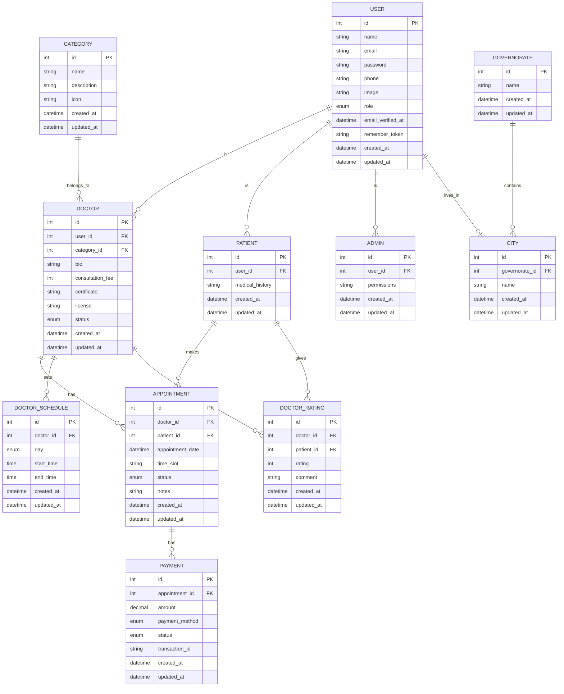
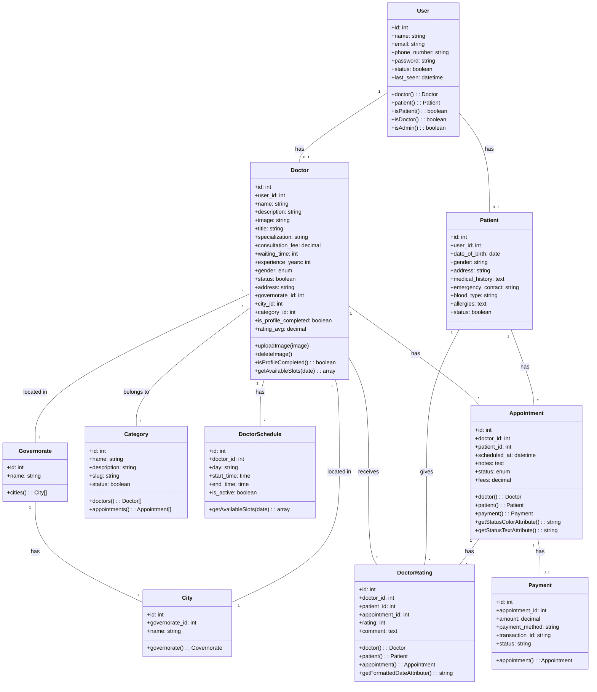
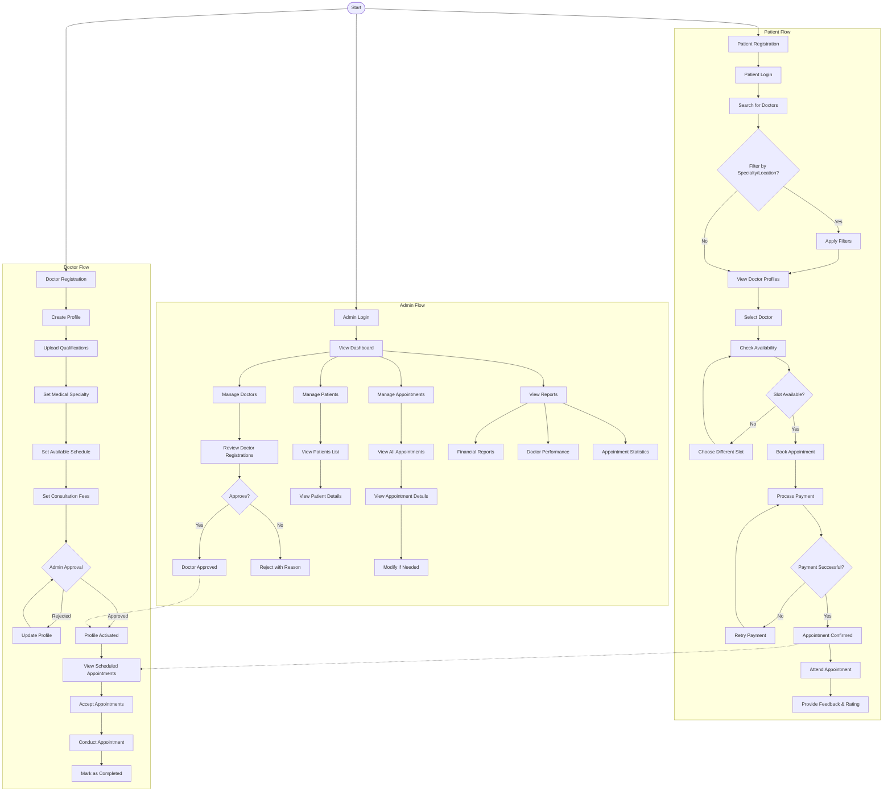
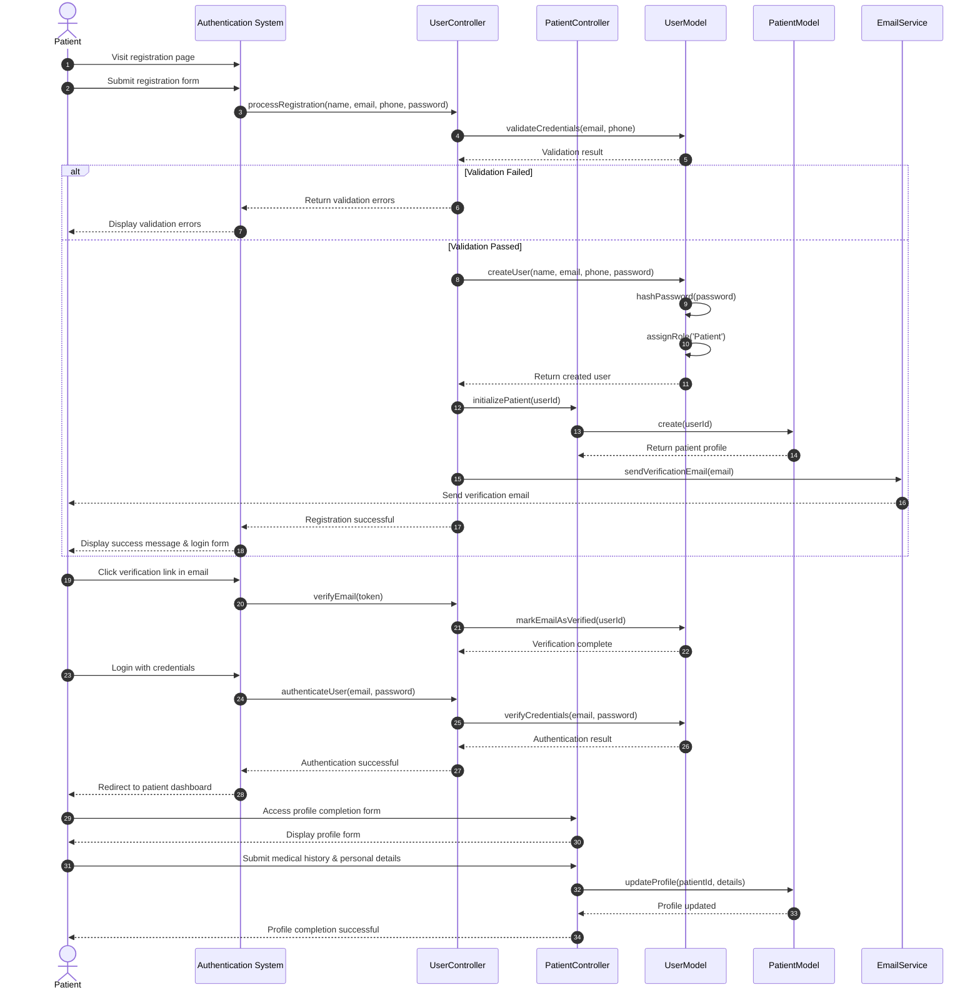
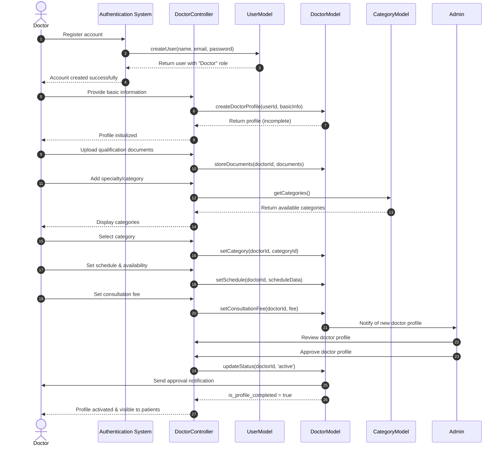
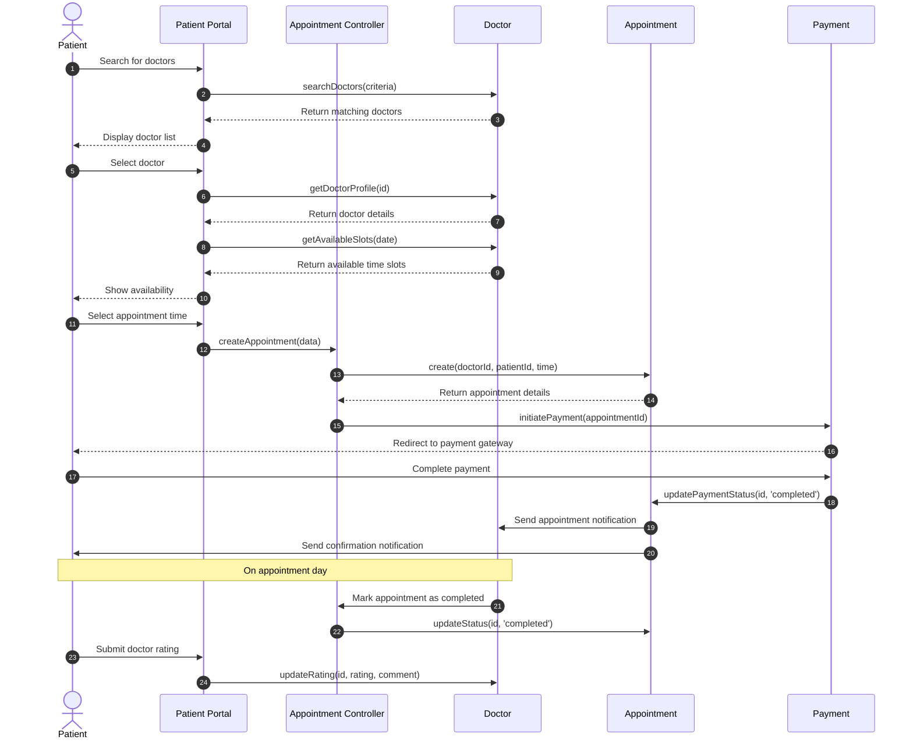
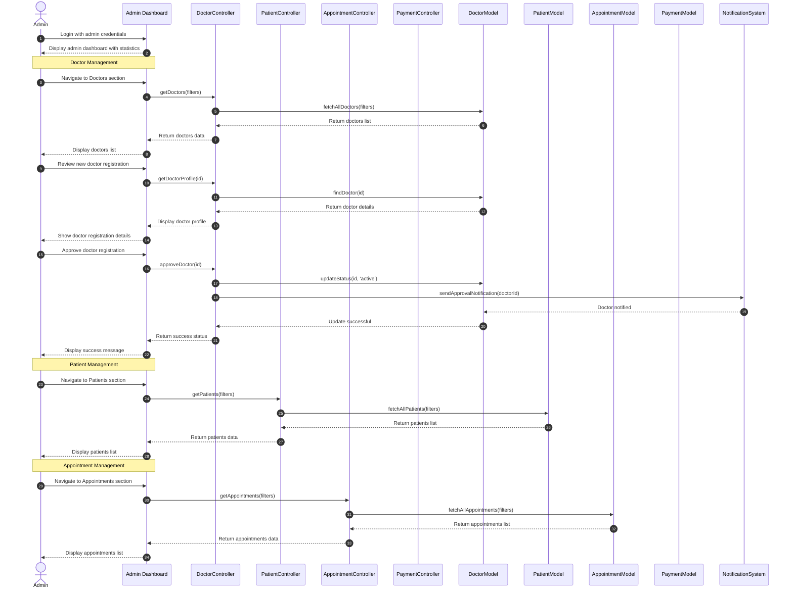

# Clinic Management System
## Technical Documentation

---

## Table of Contents
1. [Introduction](#1-introduction)
   - [Purpose](#purpose)
   - [Scope](#scope)
   - [Definitions and Acronyms](#definitions-and-acronyms)
   - [References](#references)
2. [System Overview](#2-system-overview)
   - [System Description](#system-description)
   - [User Roles](#user-roles)
   - [Key Features](#key-features)
3. [System Architecture](#3-system-architecture)
   - [Core Components](#core-components)
   - [Modular Structure](#modular-structure)
   - [Technology Stack](#technology-stack)
4. [Data Models](#4-data-models)
   - [Entity Relationship Diagram](#entity-relationship-diagram)
   - [Class Diagram](#class-diagram)
   - [Key Entity Relationships](#key-entity-relationships)
5. [System Workflows](#5-system-workflows)
   - [Activity Diagrams](#activity-diagrams)
   - [Patient Registration & Profile Management](#patient-registration--profile-management)
   - [Doctor Registration & Approval](#doctor-registration--approval)
   - [Appointment Booking Process](#appointment-booking-process)
   - [Admin Dashboard & Management](#admin-dashboard--management)
6. [Module Descriptions](#6-module-descriptions)
   - [Appointments Module](#appointments-module)
   - [Doctors Module](#doctors-module)
   - [Patients Module](#patients-module)
   - [Users/Auth Module](#usersauth-module)
   - [Payments Module](#payments-module)
   - [Specialties Module](#specialties-module)
   - [Dashboard Module](#dashboard-module)
7. [Functional Requirements](#7-functional-requirements)
   - [User Management Requirements](#user-management-requirements)
   - [Doctor Management Requirements](#doctor-management-requirements)
   - [Patient Management Requirements](#patient-management-requirements)
   - [Appointment Management Requirements](#appointment-management-requirements)
   - [Payment Management Requirements](#payment-management-requirements)
   - [Administrative Requirements](#administrative-requirements)
8. [User Stories](#8-user-stories)
   - [Patient User Stories](#patient-user-stories)
   - [Doctor User Stories](#doctor-user-stories)
   - [Administrator User Stories](#administrator-user-stories)
9. [Use Case Tables](#9-use-case-tables)
   - [Patient Use Cases](#patient-use-cases)
   - [Doctor Use Cases](#doctor-use-cases)
   - [Administrator Use Cases](#administrator-use-cases)
10. [Test Cases](#10-test-cases)
    - [Patient Module Test Cases](#patient-module-test-cases)
    - [Doctor Module Test Cases](#doctor-module-test-cases)
    - [Administrator Module Test Cases](#administrator-module-test-cases)
    - [Payment Module Test Cases](#payment-module-test-cases)
11. [Deployment Plan](#11-deployment-plan)
    - [Server Requirements](#server-requirements)
    - [Installation Procedure](#installation-procedure)
    - [Configuration Steps](#configuration-steps)
12. [Maintenance and Support](#12-maintenance-and-support)
    - [Update Procedures](#update-procedures)
    - [Backup Strategy](#backup-strategy)
    - [Troubleshooting Guide](#troubleshooting-guide)

---

## 1. Introduction

### Purpose

This document provides a comprehensive technical overview of the Clinic Management System, detailing its architecture, functionality, and implementation. It serves as the primary reference for developers, system administrators, and stakeholders involved in the development, deployment, and maintenance of the system.

### Scope

The Clinic Management System is designed to facilitate healthcare service delivery through a digital platform connecting patients with medical specialists. This documentation covers all technical aspects of the system including architecture, data models, functional requirements, user stories, test cases, and deployment procedures.

### Definitions and Acronyms

| Term/Acronym | Definition |
|--------------|------------|
| CMS | Clinic Management System |
| UI | User Interface |
| API | Application Programming Interface |
| MVC | Model-View-Controller (design pattern) |
| CRUD | Create, Read, Update, Delete (basic operations) |
| JWT | JSON Web Token (for authentication) |
| SPA | Single Page Application |
| DB | Database |
| UX | User Experience |

### References

1. Laravel Documentation - [https://laravel.com/docs](https://laravel.com/docs)
2. Stripe API Documentation - [https://stripe.com/docs/api](https://stripe.com/docs/api)
3. PHP Standards Recommendations - [https://www.php-fig.org/psr/](https://www.php-fig.org/psr/)
4. MySQL Documentation - [https://dev.mysql.com/doc/](https://dev.mysql.com/doc/)

## 2. System Overview

### System Description

The Clinic Management System is a comprehensive healthcare platform developed to streamline the process of connecting patients with medical specialists. The system facilitates appointment scheduling, doctor discovery, patient management, and administrative operations in a unified digital environment.

### User Roles

- **Patients**: End users who register, search for doctors, book appointments, and provide feedback
- **Doctors**: Healthcare professionals who register, set schedules, conduct appointments, and maintain profiles
- **Administrators**: System managers who oversee operations, approve registrations, and access reporting

### Key Features

- Patient registration and profile management
- Doctor registration, verification, and profile management
- Medical specialty categorization
- Appointment scheduling and management
- Payment processing
- Rating and feedback system
- Administrative dashboard and reporting
- User role management (Admin, Doctor, Patient)
- Geographic filtering by governorate and city

---

## 3. System Architecture

The Clinic Management System is built on Laravel, utilizing a modular architecture to isolate functionality and promote maintainability. The application follows the MVC (Model-View-Controller) design pattern and is structured as follows:

### Core Components
- **Frontend**: Blade templates with modern responsive design
- **Backend**: PHP/Laravel application server
- **Database**: MySQL relational database
- **Payment Gateway**: Stripe integration

### Modular Structure
The application uses Laravel Modules to separate concerns and organize functionality:

```
Modules/
  ├── Appointments/     - Appointment scheduling and management
  ├── Auth/             - Authentication and authorization
  ├── Contacts/         - Contact management and communication
  ├── Core/             - Core functionality shared across modules
  ├── Dashboard/        - Admin and user dashboards
  ├── Doctors/          - Doctor profile management
  ├── Patients/         - Patient profile and medical history
  ├── Payments/         - Payment processing and financial records
  ├── Specialties/      - Medical specialties categorization
  └── Users/            - User account management
```

### Technology Stack

| Component | Technology |
|-----------|------------|
| **Backend Framework** | Laravel 10.x (PHP 8.2+) |
| **Frontend** | Blade Templates, TailwindCSS, Alpine.js |
| **Database** | MySQL 8.0 |
| **Authentication** | Laravel Sanctum, JWT |
| **Module System** | Laravel Modules (nWidart) |
| **Payment Processing** | Stripe API |
| **File Storage** | AWS S3 / Local FileSystem |
| **Caching** | Redis |
| **Deployment** | Docker, Nginx |
| **Testing** | PHPUnit, Laravel Dusk |
| **CI/CD** | GitHub Actions |

---

## 4. Data Models

### Entity Relationship Diagram

This diagram illustrates the database structure for our Laravel-based clinic management system, showing all entities, their relationships, and attributes.



### Key Entity Relationships
- A USER can be a DOCTOR, PATIENT, or ADMIN (one-to-one relationships)
- DOCTORs belong to a medical CATEGORY
- DOCTORs have multiple DOCTOR_SCHEDULEs
- PATIENTs make APPOINTMENTs with DOCTORs
- APPOINTMENTs have PAYMENT records
- USERs live in specific CITYs
- CITYs belong to GOVERNORATEs
- PATIENTs can give DOCTOR_RATINGs to DOCTORs

### Class Diagram

This diagram visualizes the main entities in our clinic management system and their relationships.



---

## 5. System Workflows

### Activity Diagrams

The following activity diagram illustrates the main workflows and activities in our clinic management system, focusing on the three primary user roles: Patient, Doctor, and Admin.




### Patient Registration & Profile Management

This diagram visualizes the patient registration and profile completion process in our clinic management system.



### Doctor Registration & Approval

This diagram visualizes the doctor registration and profile completion process in our clinic management system.



### Appointment Booking Process

This diagram visualizes the appointment booking process in our clinic management system, showing interactions between patients, doctors, and the system components.



### Admin Dashboard & Management

This diagram visualizes the key administrative workflows in our clinic management system, focusing on the system administrator's perspective.



---

## 6. Module Descriptions

### Appointments Module

The Appointments module handles all appointment-related functionality in the clinic application, including creating, managing, and tracking appointments between doctors and patients.

**Key Features:**
- Appointment scheduling
- Status management (scheduled, completed, cancelled)
- Notifications for appointment events
- Reporting and analytics

**Main Entities:**
- **Appointment**: Represents a scheduled meeting between a doctor and patient
  - Includes doctor_id, patient_id, scheduled_at, status, notes, fees
  - Has relationships to Doctor, Patient, and Payment models

**Key Operations:**
- Creating new appointments
- Checking doctor availability
- Processing payments for appointments
- Updating appointment status
- Sending notifications to relevant parties
- Rating doctors after completed appointments

### Doctors Module

The Doctors module manages all doctor-related functionality in the clinic application, including profile management, specialization, scheduling, and doctor-specific operations.

**Key Features:**
- Doctor profile management
- Specialization and categorization
- Rating and feedback system
- Scheduling and availability
- Integration with appointments system

**Main Entities:**
- **Doctor**: Extends the User model with doctor-specific information
  - Professional details (specialization, experience, credentials)
  - Availability schedule and consultation fees
  - Rating and review handling
- **DoctorSchedule**: Manages doctor availability by day and time
- **DoctorRating**: Stores patient ratings and feedback

**Key Operations:**
- Doctor registration and profile creation
- Admin approval workflow
- Setting and managing schedules
- Managing appointments and patient interactions
- Processing ratings and feedback

### Patients Module

The Patients module handles all patient-related functionality in the clinic application, including profile management, medical history, and patient-specific operations.

**Key Features:**
- Patient profile management
- Medical history tracking
- Appointment booking interface
- Integration with payment system

**Main Entities:**
- **Patient**: Extends the User model with patient-specific information
  - Medical history and health information
  - Emergency contacts and personal details
  - Appointment history

**Key Operations:**
- Patient registration and profile creation
- Medical history management
- Appointment booking and tracking
- Doctor search and selection
- Payment processing for appointments

### Users/Auth Module

The Users/Auth module handles user authentication, authorization, and account management across the entire clinic system.

**Key Features:**
- User registration
- Authentication and login
- Role-based permission management
- Password reset functionality
- Email verification

**Main Entities:**
- **User**: Core user model with authentication details
  - Contains common user attributes (name, email, password)
  - Role assignment (Admin, Doctor, Patient)
  - Account status and verification

**Key Operations:**
- User registration and login
- Password management
- Role assignment and permissions
- Email verification
- Session management

### Payments Module

The Payments module handles all financial transactions in the clinic system, particularly focused on appointment payments.

**Key Features:**
- Payment processing
- Transaction records
- Integration with Stripe
- Payment status tracking
- Receipts and invoices

**Main Entities:**
- **Payment**: Records financial transactions for appointments
  - Links to the corresponding appointment
  - Tracks payment amount, method, and status
  - Stores transaction references

**Key Operations:**
- Processing appointment payments
- Generating receipts
- Managing payment statuses
- Reporting on financial transactions
- Handling refunds when necessary

### Specialties Module

The Specialties module manages medical specialties and categories for doctor classification and search functionality.

**Key Features:**
- Category management
- Doctor specialization assignment
- Specialty-based search

**Main Entities:**
- **Category**: Represents medical specialties
  - Name, description, and icon
  - Relationship to doctors

**Key Operations:**
- Creating and managing specialties
- Assigning specialties to doctors
- Specialty-based filtering of doctor search results

### Dashboard Module

The Dashboard module provides overview interfaces and reporting for all user types, with particular focus on administrative functions.

**Key Features:**
- Admin dashboard with system overview
- Doctor dashboard with appointment management
- Patient dashboard with booking history
- Statistics and reporting
- Activity monitoring

**Key Operations:**
- Generating system statistics
- Providing at-a-glance overviews
- Monitoring key performance indicators
- Displaying recent activity
- Accessing frequently used functions

---

## 7. Functional Requirements

This section outlines the functional requirements of the Clinic Management System, organized by user role and system functionality.

### User Management Requirements

| ID | Requirement | Priority | Status |
|----|-------------|----------|--------|
| FR-UM-01 | The system shall allow users to register as patients with email, phone, password, and basic information. | High | Implemented |
| FR-UM-02 | The system shall allow healthcare professionals to register as doctors with credentials and qualifications. | High | Implemented |
| FR-UM-03 | The system shall implement email verification for all new user registrations. | Medium | Implemented |
| FR-UM-04 | The system shall support password reset functionality for all users. | Medium | Implemented |
| FR-UM-05 | The system shall maintain separate user roles for patients, doctors, and administrators. | High | Implemented |
| FR-UM-06 | The system shall allow users to update their profile information. | Medium | Implemented |
| FR-UM-07 | The system shall support image upload for user profile pictures. | Low | Implemented |
| FR-UM-08 | The system shall maintain user login history and last seen timestamps. | Low | Implemented |

### Doctor Management Requirements

| ID | Requirement | Priority | Status |
|----|-------------|----------|--------|
| FR-DM-01 | The system shall allow doctors to create and maintain professional profiles. | High | Implemented |
| FR-DM-02 | The system shall support document upload for doctor qualifications and licenses. | High | Implemented |
| FR-DM-03 | The system shall enable doctors to select their medical specialty from predefined categories. | High | Implemented |
| FR-DM-04 | The system shall allow doctors to set their consultation fees. | High | Implemented |
| FR-DM-05 | The system shall support doctor profile approval workflow by administrators. | High | Implemented |
| FR-DM-06 | The system shall allow doctors to define their availability schedule by day and time. | High | Implemented |
| FR-DM-07 | The system shall display doctor profiles to patients with ratings and feedback. | Medium | Implemented |
| FR-DM-08 | The system shall allow doctors to view their rating statistics and patient feedback. | Medium | Implemented |

### Patient Management Requirements

| ID | Requirement | Priority | Status |
|----|-------------|----------|--------|
| FR-PM-01 | The system shall allow patients to create and maintain personal profiles. | High | Implemented |
| FR-PM-02 | The system shall allow patients to record and update their medical history. | Medium | Implemented |
| FR-PM-03 | The system shall enable patients to search for doctors by specialty. | High | Implemented |
| FR-PM-04 | The system shall enable patients to filter doctors by location (governorate/city). | Medium | Implemented |
| FR-PM-05 | The system shall allow patients to view doctor profiles with all relevant information. | High | Implemented |
| FR-PM-06 | The system shall enable patients to rate and review doctors after appointments. | Medium | Implemented |
| FR-PM-07 | The system shall maintain a history of patient appointments and consultations. | Medium | Implemented |
| FR-PM-08 | The system shall allow patients to update their personal and contact information. | Medium | Implemented |

### Appointment Management Requirements

| ID | Requirement | Priority | Status |
|----|-------------|----------|--------|
| FR-AM-01 | The system shall display available appointment slots based on doctor availability. | High | Implemented |
| FR-AM-02 | The system shall allow patients to book appointments with available doctors. | High | Implemented |
| FR-AM-03 | The system shall process payments for booking confirmations. | High | Implemented |
| FR-AM-04 | The system shall send confirmation notifications for new appointments. | Medium | Implemented |
| FR-AM-05 | The system shall allow patients to view their upcoming and past appointments. | High | Implemented |
| FR-AM-06 | The system shall allow patients to cancel appointments with sufficient notice. | Medium | Implemented |
| FR-AM-07 | The system shall allow doctors to view their scheduled appointments. | High | Implemented |
| FR-AM-08 | The system shall maintain appointment status (scheduled, completed, cancelled). | High | Implemented |
| FR-AM-09 | The system shall allow doctors to mark appointments as completed. | Medium | Implemented |
| FR-AM-10 | The system shall enable rescheduling of appointments when necessary. | Medium | Pending |

### Payment Management Requirements

| ID | Requirement | Priority | Status |
|----|-------------|----------|--------|
| FR-PM-01 | The system shall integrate with Stripe payment gateway. | High | Implemented |
| FR-PM-02 | The system shall process and record payment transactions for appointments. | High | Implemented |
| FR-PM-03 | The system shall generate receipts for successful payments. | Medium | Implemented |
| FR-PM-04 | The system shall maintain payment history for all transactions. | Medium | Implemented |
| FR-PM-05 | The system shall handle payment failures and provide appropriate feedback. | Medium | Implemented |
| FR-PM-06 | The system shall support refund processing for cancelled appointments. | Medium | Pending |
| FR-PM-07 | The system shall generate financial reports for administrators. | Low | Implemented |
| FR-PM-08 | The system shall ensure secure handling of payment data. | High | Implemented |

### Administrative Requirements

| ID | Requirement | Priority | Status |
|----|-------------|----------|--------|
| FR-AD-01 | The system shall provide an administrative dashboard with system statistics. | Medium | Implemented |
| FR-AD-02 | The system shall allow administrators to approve or reject doctor registrations. | High | Implemented |
| FR-AD-03 | The system shall allow administrators to manage medical specialties. | Medium | Implemented |
| FR-AD-04 | The system shall allow administrators to manage location data (governorates/cities). | Medium | Implemented |
| FR-AD-05 | The system shall allow administrators to view and manage all users. | Medium | Implemented |
| FR-AD-06 | The system shall enable administrators to generate system reports. | Medium | Implemented |
| FR-AD-07 | The system shall allow administrators to resolve disputes between doctors and patients. | Low | Pending |
| FR-AD-08 | The system shall allow administrators to monitor system performance. | Low | Implemented |

---

## 8. User Stories

### Patient User Stories

| ID | User Story | Acceptance Criteria |
|----|------------|---------------------|
| P1 | As a patient, I want to register an account so that I can access the clinic's services. | - Registration form includes name, email, phone, and password fields<br>- Email verification is required<br>- Basic validation for all fields<br>- Successful registration redirects to profile completion |
| P2 | As a patient, I want to search for doctors by specialty and location so that I can find the most convenient healthcare provider. | - Searchable list of medical specialties<br>- Filtering by governorate and city<br>- Results sortable by rating, fees, and experience<br>- Pagination for search results |
| P3 | As a patient, I want to view doctor profiles with qualifications and patient ratings so that I can make informed decisions. | - Doctor profile displays name, photo, specialty, bio, experience<br>- Shows average rating and number of reviews<br>- Lists qualifications and certifications<br>- Shows consultation fees and waiting time |
| P4 | As a patient, I want to see available appointment slots so that I can book a convenient time. | - Calendar view of available dates<br>- Available time slots clearly marked<br>- Unavailable slots disabled or hidden<br>- Time slots shown in patient's local timezone |
| P5 | As a patient, I want to book and pay for appointments online so that I can secure my consultation. | - Appointment booking form with time selection<br>- Integrated payment gateway<br>- Support for multiple payment methods<br>- Email confirmation after booking |
| P6 | As a patient, I want to view my upcoming and past appointments so that I can manage my healthcare schedule. | - Separated lists for past and upcoming appointments<br>- Status indicators (scheduled, completed, cancelled)<br>- Option to cancel appointments with sufficient notice<br>- Option to reschedule if available |
| P7 | As a patient, I want to rate and review doctors after appointments so that I can share my experience with others. | - Rating system (1-5 stars)<br>- Text field for detailed reviews<br>- Only enabled after appointment completion<br>- Option to edit or delete own reviews |
| P8 | As a patient, I want to update my medical history and personal information so that doctors have accurate information. | - Editable profile fields<br>- Medical history section with allergies and conditions<br>- Password-protected changes<br>- Option to upload relevant documents |

### Doctor User Stories

| ID | User Story | Acceptance Criteria |
|----|------------|---------------------|
| D1 | As a doctor, I want to register and submit my credentials so that I can offer services through the platform. | - Registration with basic information<br>- Document upload for qualifications/licenses<br>- Specialty selection<br>- Terms & conditions acceptance |
| D2 | As a doctor, I want to set my availability schedule so that patients can book during times I'm available. | - Weekly scheduling interface<br>- Ability to set recurring schedules<br>- Option for blocking specific dates<br>- Time slot duration settings |
| D3 | As a doctor, I want to view and manage my appointment bookings so that I can prepare for consultations. | - List view of all appointments<br>- Calendar view option<br>- Patient information access<br>- Appointment status management |
| D4 | As a doctor, I want to set and adjust my consultation fees so that I can manage my practice economics. | - Fee setting interface<br>- Different fees for first/follow-up visits<br>- Fee history tracking<br>- Currency selection |
| D5 | As a doctor, I want to view patient medical histories before appointments so that I can provide better care. | - Access to patient-provided medical information<br>- Previous visit notes if applicable<br>- Allergies and medication warnings<br>- Secure and HIPAA-compliant access |
| D6 | As a doctor, I want to view my ratings and reviews so that I can improve my services. | - Overall rating display<br>- Individual review listing<br>- Feedback metrics and analysis<br>- Option to respond to reviews |
| D7 | As a doctor, I want to update my professional profile so that patients can see my latest qualifications. | - Editable professional information<br>- Qualification and certification updates<br>- Profile photo management<br>- Visibility settings |
| D8 | As a doctor, I want to receive notifications about new appointments so that I'm aware of my schedule changes. | - Email notifications<br>- In-app notifications<br>- Notification preferences settings<br>- Calendar integration options |

### Administrator User Stories

| ID | User Story | Acceptance Criteria |
|----|------------|---------------------|
| A1 | As an admin, I want to review and approve doctor registrations so that only qualified professionals can use the platform. | - List of pending doctor applications<br>- Document verification interface<br>- Approval/rejection workflow<br>- Communication tools for follow-up |
| A2 | As an admin, I want to manage medical specialties so that doctors can be properly categorized. | - Add/edit/delete specialty categories<br>- Associate icons with specialties<br>- Maintain specialty descriptions<br>- Reorder specialty listings |
| A3 | As an admin, I want to view system statistics and analytics so that I can monitor platform performance. | - Dashboard with key metrics<br>- Appointment volume tracking<br>- User growth statistics<br>- Financial summaries |
| A4 | As an admin, I want to manage user accounts so that I can assist with account issues. | - User search functionality<br>- Account status management<br>- Password reset capabilities<br>- Account merging for duplicates |
| A5 | As an admin, I want to configure system settings so that I can optimize the platform operations. | - Fee structure settings<br>- Notification templates<br>- System maintenance scheduling<br>- Integration configuration |
| A6 | As an admin, I want to generate reports on appointments and payments so that I can track business performance. | - Customizable reporting period<br>- Multiple report formats (PDF, CSV, etc.)<br>- Financial reconciliation tools<br>- Graphical data visualization |
| A7 | As an admin, I want to manage location data (governorates/cities) so that geographic filtering works correctly. | - Location hierarchy management<br>- Add/edit/delete locations<br>- Bulk import of location data<br>- Geocoding integration |
| A8 | As an admin, I want to handle disputes and issues between doctors and patients so that I can maintain platform integrity. | - Case management system<br>- Communication history tracking<br>- Resolution workflow<br>- Appeals process |

## 9. Use Case Tables

### Patient Use Cases

#### UC-P1: Patient Registration

| Use Case ID | UC-P1 |
|-------------|-------|
| **Use Case Name** | Patient Registration |
| **Actor** | Patient |
| **Description** | This use case describes the process of a new patient registering an account in the system. |
| **Trigger** | Patient decides to register for an account on the clinic management platform. |
| **Preconditions** | 1. Patient has access to the internet and the clinic registration page.<br>2. Patient has a valid email address and phone number. |
| **Normal Flow** | 1. Patient navigates to the registration page.<br>2. Patient selects "Register as Patient".<br>3. Patient enters required information (name, email, phone, password).<br>4. Patient accepts terms and conditions.<br>5. Patient submits registration form.<br>6. System validates input information.<br>7. System creates a new patient account.<br>8. System sends a verification email to the patient.<br>9. Patient clicks on the verification link in the email.<br>10. System verifies the email address and activates the account.<br>11. System redirects patient to login page. |
| **Alternative Flows** | **A1: Invalid Information**<br>6a. System detects invalid information.<br>6b. System displays appropriate error message.<br>6c. Patient corrects information and resubmits.<br>6d. Flow continues from step 6.<br><br>**A2: Email Already Registered**<br>6a. System detects email is already registered.<br>6b. System informs patient and suggests password reset or using a different email.<br>6c. Patient selects an option and proceeds accordingly. |
| **Postconditions** | 1. A new patient account is created in the system.<br>2. Patient can log in using their credentials.<br>3. Patient profile is initialized and ready for completion. |
| **Business Rules** | 1. Email addresses must be unique in the system.<br>2. Passwords must meet minimum security requirements (8+ characters, mixed case, numbers).<br>3. Phone numbers must be valid and properly formatted. |
| **Notes and Issues** | - Email verification is required before accessing full system functionality.<br>- Patients will be prompted to complete their medical profile after first login. |

#### UC-P2: Search for Doctors

| Use Case ID | UC-P2 |
|-------------|-------|
| **Use Case Name** | Search for Doctors |
| **Actor** | Patient |
| **Description** | This use case describes how a patient searches for doctors using various criteria. |
| **Trigger** | Patient needs to find a doctor for consultation. |
| **Preconditions** | 1. Patient is logged into their account.<br>2. Patient has access to the search functionality. |
| **Normal Flow** | 1. Patient navigates to the doctor search page.<br>2. Patient enters search criteria (specialty, location, name, etc.).<br>3. Patient initiates the search.<br>4. System retrieves and displays matching doctors with basic information.<br>5. Patient reviews the search results.<br>6. Patient can apply additional filters or sorting options.<br>7. System updates the results based on selected filters/sorting. |
| **Alternative Flows** | **A1: No Results Found**<br>4a. System finds no doctors matching the search criteria.<br>4b. System displays a message indicating no results.<br>4c. System suggests broadening search criteria.<br>4d. Patient modifies search parameters and tries again.<br><br>**A2: Too Many Results**<br>4a. System finds a large number of matching doctors.<br>4b. System paginates results and displays the first page.<br>4c. Patient can navigate through result pages or refine search. |
| **Postconditions** | 1. Patient views a list of doctors matching their search criteria.<br>2. Patient can select a doctor to view detailed profile. |
| **Business Rules** | 1. Only approved and active doctors appear in search results.<br>2. Search results display doctors with their specialties, ratings, and basic information.<br>3. Doctors are sorted by relevance to search criteria by default. |
| **Notes and Issues** | - Search functionality includes text search, specialty filtering, location filtering, and rating filtering.<br>- Results can be exported or shared if needed. |

#### UC-P3: Book Appointment

| Use Case ID | UC-P3 |
|-------------|-------|
| **Use Case Name** | Book Appointment |
| **Actor** | Patient |
| **Description** | This use case describes the process of a patient booking an appointment with a doctor. |
| **Trigger** | Patient decides to schedule an appointment with a selected doctor. |
| **Preconditions** | 1. Patient is logged into their account.<br>2. Patient has selected a doctor's profile.<br>3. Doctor has available appointment slots. |
| **Normal Flow** | 1. Patient views doctor's profile and clicks "Book Appointment".<br>2. System displays calendar with available dates and time slots.<br>3. Patient selects preferred date and time slot.<br>4. System confirms slot availability and displays appointment details.<br>5. Patient confirms appointment details and proceeds to payment.<br>6. Patient enters payment information.<br>7. System processes payment.<br>8. System confirms appointment booking.<br>9. System sends confirmation notification to patient and doctor. |
| **Alternative Flows** | **A1: Selected Time Slot Becomes Unavailable**<br>4a. System detects selected time slot is no longer available.<br>4b. System informs patient and shows alternative slots.<br>4c. Patient selects a different time slot.<br>4d. Flow continues from step 4.<br><br>**A2: Payment Failure**<br>7a. System detects payment processing failure.<br>7b. System notifies patient of payment issue.<br>7c. Patient can retry payment or select a different payment method.<br>7d. Flow continues from step 7 or terminates if patient cancels. |
| **Postconditions** | 1. Appointment is scheduled in the system.<br>2. Payment is processed successfully.<br>3. Both patient and doctor are notified of the appointment.<br>4. Appointment appears in patient's upcoming appointments list.<br>5. Appointment appears in doctor's schedule. |
| **Business Rules** | 1. Appointments require upfront payment.<br>2. Double-booking for the same time slot is prevented.<br>3. Patient cannot book appointments for past dates.<br>4. Appointments must be booked at least 1 hour in advance. |
| **Notes and Issues** | - System should implement concurrency control to handle simultaneous booking attempts.<br>- Appointment reminders will be sent 24 hours before scheduled time. |

#### UC-P4: Manage Appointments

| Use Case ID | UC-P4 |
|-------------|-------|
| **Use Case Name** | Manage Appointments |
| **Actor** | Patient |
| **Description** | This use case describes how patients view and manage their existing appointments. |
| **Trigger** | Patient wants to view, modify, or cancel existing appointments. |
| **Preconditions** | 1. Patient is logged into their account.<br>2. Patient has at least one appointment in the system. |
| **Normal Flow** | 1. Patient navigates to "My Appointments" section.<br>2. System displays patient's appointments, categorized as upcoming and past.<br>3. Patient selects an appointment to view details.<br>4. System displays comprehensive appointment information.<br>5. Patient can choose to cancel or reschedule the appointment (if applicable).<br>6. If cancelling, patient confirms cancellation.<br>7. System updates appointment status and processes any applicable refunds.<br>8. System sends notification of the change to relevant parties. |
| **Alternative Flows** | **A1: Reschedule Appointment**<br>5a. Patient chooses to reschedule appointment.<br>5b. System displays available alternative time slots.<br>5c. Patient selects new time slot.<br>5d. System updates appointment with new time.<br>5e. System sends updated appointment notification.<br><br>**A2: Late Cancellation**<br>6a. System detects cancellation is within 24 hours of appointment.<br>6b. System informs patient of late cancellation policy.<br>6c. Patient confirms understanding of partial/no refund policy.<br>6d. Flow continues from step 7. |
| **Postconditions** | 1. Appointment status is updated in the system.<br>2. Patient appointment list reflects changes.<br>3. Doctor's schedule reflects changes.<br>4. Refund is processed if applicable per cancellation policy. |
| **Business Rules** | 1. Appointments can be cancelled up to 24 hours before scheduled time for full refund.<br>2. Late cancellations may incur partial or no refund based on clinic policy.<br>3. Rescheduling follows same time restrictions as cancellations.<br>4. Past appointments cannot be modified. |
| **Notes and Issues** | - System should maintain a complete history of appointment changes.<br>- Cancelled slots should be immediately made available for other patients. |

#### UC-P5: Rate Doctor

| Use Case ID | UC-P5 |
|-------------|-------|
| **Use Case Name** | Rate Doctor |
| **Actor** | Patient |
| **Description** | This use case describes how patients rate doctors and provide feedback after appointments. |
| **Trigger** | Patient completes an appointment and wants to provide feedback. |
| **Preconditions** | 1. Patient is logged into their account.<br>2. Patient has at least one completed appointment with the doctor.<br>3. Patient has not already rated this specific appointment. |
| **Normal Flow** | 1. Patient navigates to completed appointments list.<br>2. Patient selects the completed appointment to rate.<br>3. System displays rating form with star rating (1-5) and comment field.<br>4. Patient assigns star rating.<br>5. Patient enters feedback comments (optional).<br>6. Patient submits the rating.<br>7. System saves the rating and associates it with the doctor and appointment.<br>8. System updates doctor's average rating.<br>9. System confirms successful submission. |
| **Alternative Flows** | **A1: Patient Edits Previous Rating**<br>1a. Patient navigates to previously rated appointment.<br>1b. System displays current rating and comments.<br>1c. Patient modifies rating and/or comments.<br>1d. Flow continues from step 6.<br><br>**A2: Patient Removes Rating**<br>1a. Patient navigates to previously rated appointment.<br>1b. System displays current rating and comments.<br>1c. Patient selects option to remove rating.<br>1d. System removes rating and updates doctor's average rating.<br>1e. System confirms removal. |
| **Postconditions** | 1. Doctor rating is recorded in the system.<br>2. Doctor's average rating is updated.<br>3. Rating appears on doctor's public profile (anonymized if configured).<br>4. Doctor receives notification of new rating. |
| **Business Rules** | 1. Patients can only rate appointments they have completed.<br>2. Patients can edit or remove their ratings within 30 days of submission.<br>3. Ratings must include star rating, comments are optional.<br>4. Inappropriate content in comments can be flagged and removed by administrators. |
| **Notes and Issues** | - System should implement moderation for review comments.<br>- Analytics should track rating patterns and flag unusual activity. |

#### UC-P6: Update Medical Profile

| Use Case ID | UC-P6 |
|-------------|-------|
| **Use Case Name** | Update Medical Profile |
| **Actor** | Patient |
| **Description** | This use case describes how patients update their personal and medical information. |
| **Trigger** | Patient needs to add or update information in their medical profile. |
| **Preconditions** | 1. Patient is logged into their account.<br>2. Patient has access to their profile settings. |
| **Normal Flow** | 1. Patient navigates to profile settings.<br>2. System displays current profile information.<br>3. Patient selects "Edit Medical Information".<br>4. System displays editable medical history form.<br>5. Patient updates information (allergies, conditions, medications, etc.).<br>6. Patient saves changes.<br>7. System validates input.<br>8. System updates patient profile.<br>9. System confirms successful update. |
| **Alternative Flows** | **A1: Invalid Information**<br>7a. System detects invalid information format.<br>7b. System highlights fields with errors.<br>7c. Patient corrects information.<br>7d. Flow continues from step 6.<br><br>**A2: Upload Medical Records**<br>5a. Patient chooses to upload medical records.<br>5b. System displays file upload interface.<br>5c. Patient selects and uploads files.<br>5d. System validates file types and sizes.<br>5e. Flow continues from step 6. |
| **Postconditions** | 1. Patient medical profile is updated with new information.<br>2. Updated information is available to doctors during future appointments.<br>3. System maintains a history of profile changes. |
| **Business Rules** | 1. Medical profile information is private and only accessible to the patient and authorized doctors.<br>2. Uploaded files must be in supported formats (PDF, JPG, PNG) and under size limit (10MB).<br>3. Certain fields may require specific formats (e.g., blood type, dates). |
| **Notes and Issues** | - System should prompt patients to review and update medical information periodically.<br>- Critical medical information should be highlighted for doctors during appointments. |

### Doctor Use Cases

#### UC-D1: Doctor Registration

| Use Case ID | UC-D1 |
|-------------|-------|
| **Use Case Name** | Doctor Registration |
| **Actor** | Doctor |
| **Description** | This use case describes the process of a healthcare professional registering as a doctor on the platform. |
| **Trigger** | Healthcare professional decides to register as a doctor on the clinic management system. |
| **Preconditions** | 1. Doctor has valid professional credentials and license.<br>2. Doctor has access to the clinic registration page. |
| **Normal Flow** | 1. Doctor navigates to registration page.<br>2. Doctor selects "Register as Healthcare Provider".<br>3. Doctor completes basic account information (name, email, phone, password).<br>4. Doctor submits initial registration.<br>5. System creates account and sends verification email.<br>6. Doctor verifies email address.<br>7. Doctor logs in and completes professional profile.<br>8. Doctor uploads required credentials (medical license, certifications).<br>9. Doctor selects specialty category.<br>10. Doctor provides professional biography and experience.<br>11. Doctor submits profile for verification.<br>12. System notifies administrators of new doctor registration. |
| **Alternative Flows** | **A1: Incomplete Documentation**<br>8a. Doctor does not have all required documents ready.<br>8b. Doctor saves progress as draft.<br>8c. Doctor returns later to complete profile.<br>8d. Flow continues from the point where doctor left off.<br><br>**A2: Specialty Not Listed**<br>9a. Doctor cannot find appropriate specialty in list.<br>9b. Doctor selects "Other" and provides specialty details.<br>9c. Flow continues from step 10. |
| **Postconditions** | 1. Doctor account is created but marked as "Pending Approval".<br>2. Administrator is notified of new doctor registration requiring verification.<br>3. Doctor is notified that their account is under review. |
| **Business Rules** | 1. Doctor must provide valid professional license number for verification.<br>2. Credentials must be current and not expired.<br>3. Doctors must select at least one specialty category.<br>4. Doctor profiles require administrative approval before becoming active. |
| **Notes and Issues** | - Verification process may include third-party credential verification.<br>- System should provide estimated approval timeframe to doctors. |

#### UC-D2: Set Availability Schedule

| Use Case ID | UC-D2 |
|-------------|-------|
| **Use Case Name** | Set Availability Schedule |
| **Actor** | Doctor |
| **Description** | This use case describes how doctors define their availability for appointments. |
| **Trigger** | Doctor needs to set or update their availability schedule. |
| **Preconditions** | 1. Doctor is registered and approved in the system.<br>2. Doctor is logged into their account. |
| **Normal Flow** | 1. Doctor navigates to "My Schedule" section.<br>2. System displays current schedule if any exists.<br>3. Doctor selects "Edit Schedule".<br>4. System displays weekly calendar interface.<br>5. Doctor defines working days and hours.<br>6. Doctor defines appointment slot duration.<br>7. Doctor sets recurring schedule pattern.<br>8. Doctor marks any exception dates (holidays, time off).<br>9. Doctor saves the schedule.<br>10. System validates schedule settings.<br>11. System updates doctor's availability.<br>12. System confirms successful update. |
| **Alternative Flows** | **A1: Modify Existing Appointments**<br>9a. System detects schedule changes affect existing appointments.<br>9b. System warns doctor and displays affected appointments.<br>9c. Doctor reviews conflicts and makes adjustments.<br>9d. Flow continues from step 9.<br><br>**A2: Temporary Schedule Change**<br>3a. Doctor selects "Add Exception" instead of "Edit Schedule".<br>3b. Doctor specifies date range for temporary change.<br>3c. Doctor defines special hours for that period.<br>3d. Flow continues from step 9. |
| **Postconditions** | 1. Doctor's availability schedule is updated in the system.<br>2. Available time slots are generated based on schedule and slot duration.<br>3. Patients can book appointments during defined available slots. |
| **Business Rules** | 1. Schedule changes should not affect already booked appointments.<br>2. Minimum appointment duration is 15 minutes.<br>3. Appointments must be scheduled during clinic operational hours.<br>4. Buffer time between appointments can be configured by doctor. |
| **Notes and Issues** | - System should support recurring schedule patterns.<br>- Integration with external calendar systems should be considered. |

#### UC-D3: Manage Doctor Appointments

| Use Case ID | UC-D3 |
|-------------|-------|
| **Use Case Name** | Manage Doctor Appointments |
| **Actor** | Doctor |
| **Description** | This use case describes how doctors view and manage their appointment schedule. |
| **Trigger** | Doctor wants to view or manage upcoming appointments. |
| **Preconditions** | 1. Doctor is logged into their account.<br>2. Doctor has at least one scheduled appointment. |
| **Normal Flow** | 1. Doctor navigates to "My Appointments" dashboard.<br>2. System displays appointments organized by date and status.<br>3. Doctor can filter view by date range, status, or patient.<br>4. Doctor selects an appointment to view details.<br>5. System displays comprehensive appointment information and patient details.<br>6. Doctor can update appointment status (confirm, complete, cancel).<br>7. Doctor can add notes to the appointment.<br>8. System saves any changes and sends notifications if needed. |
| **Alternative Flows** | **A1: Cancel Appointment**<br>6a. Doctor selects to cancel appointment.<br>6b. System requests cancellation reason.<br>6c. Doctor provides reason for cancellation.<br>6d. System updates appointment status and notifies patient.<br>6e. System initiates refund process if applicable.<br><br>**A2: Reschedule Appointment**<br>6a. Doctor needs to reschedule appointment.<br>6b. Doctor selects "Reschedule" option.<br>6c. System displays available alternative slots.<br>6d. Doctor selects new time slot and provides reason.<br>6e. System updates appointment and notifies patient. |
| **Postconditions** | 1. Appointment status is updated if changed.<br>2. Notifications are sent to affected parties.<br>3. Doctor's appointment list reflects the changes.<br>4. System maintains appointment history with audit trail. |
| **Business Rules** | 1. Doctors should provide reason for cancellations or reschedules.<br>2. Last-minute cancellations by doctors do not incur fees for patients.<br>3. Appointment can be marked complete only at or after scheduled time.<br>4. Notes added to appointments must comply with medical privacy regulations. |
| **Notes and Issues** | - System should support quick rescheduling options.<br>- Video consultation links should be automatically generated for virtual appointments. |

### Administrator Use Cases

#### UC-A1: Approve Doctor Registration

| Use Case ID | UC-A1 |
|-------------|-------|
| **Use Case Name** | Approve Doctor Registration |
| **Actor** | Administrator |
| **Description** | This use case describes how administrators review and approve doctor registration applications. |
| **Trigger** | New doctor registration submission requires review. |
| **Preconditions** | 1. Administrator is logged into the system.<br>2. At least one doctor registration is pending approval.<br>3. Administrator has permission to approve registrations. |
| **Normal Flow** | 1. Administrator navigates to "Doctor Applications" section.<br>2. System displays list of pending doctor applications.<br>3. Administrator selects an application to review.<br>4. System displays detailed doctor information and uploaded credentials.<br>5. Administrator reviews personal information, credentials, and specialty.<br>6. Administrator verifies license validity using external resources if needed.<br>7. Administrator makes approval decision.<br>8. Administrator enters any notes about the decision.<br>9. System updates doctor status (approved or rejected).<br>10. System sends notification to doctor about decision.<br>11. If approved, doctor profile becomes active in the system. |
| **Alternative Flows** | **A1: Request Additional Information**<br>7a. Administrator determines more information is needed.<br>7b. Administrator selects "Request Information" option.<br>7c. Administrator enters specific information request.<br>7d. System sends request to doctor.<br>7e. Process pauses until doctor responds.<br><br>**A2: Reject Application**<br>7a. Administrator determines application should be rejected.<br>7b. Administrator selects "Reject" option.<br>7c. Administrator provides detailed reason for rejection.<br>7d. System updates doctor status and sends rejection notification. |
| **Postconditions** | 1. Doctor application status is updated to approved, rejected, or pending further information.<br>2. Doctor is notified of decision via email and in-system notification.<br>3. If approved, doctor profile becomes visible in doctor search.<br>4. System maintains record of approval process and decision. |
| **Business Rules** | 1. All required documentation must be verified before approval.<br>2. Approval decisions must include reviewer identification for audit purposes.<br>3. Rejection reasons must be documented in detail.<br>4. License validation must be performed against official medical registries. |
| **Notes and Issues** | - Integration with external license verification systems would improve process.<br>- System should flag applications with suspicious patterns for additional review. |

#### UC-A2: Generate System Reports

| Use Case ID | UC-A2 |
|-------------|-------|
| **Use Case Name** | Generate System Reports |
| **Actor** | Administrator |
| **Description** | This use case describes how administrators generate and view system reports and analytics. |
| **Trigger** | Administrator needs to analyze system data or create reports. |
| **Preconditions** | 1. Administrator is logged into the system.<br>2. Administrator has reporting permissions. |
| **Normal Flow** | 1. Administrator navigates to "Reports & Analytics" section.<br>2. System displays available report types.<br>3. Administrator selects desired report type.<br>4. System displays report parameter options.<br>5. Administrator configures report parameters (date range, filters, grouping).<br>6. Administrator generates the report.<br>7. System processes data and displays report with visualizations.<br>8. Administrator reviews report.<br>9. Administrator can export report in desired format (PDF, CSV, Excel). |
| **Alternative Flows** | **A1: Schedule Recurring Report**<br>6a. Administrator selects "Schedule Report" instead of generating immediately.<br>6b. Administrator configures schedule parameters (frequency, delivery method).<br>6c. System saves report configuration and scheduling.<br>6d. Report will be generated and delivered automatically per schedule.<br><br>**A2: Customize Report**<br>3a. Administrator selects "Custom Report" option.<br>3b. Administrator selects specific metrics and dimensions to include.<br>3c. Administrator configures custom visualizations.<br>3d. Flow continues from step 5. |
| **Postconditions** | 1. Report is generated and displayed to administrator.<br>2. Report is exported in selected format if requested.<br>3. Report configuration is saved for future use if selected.<br>4. System maintains log of report generation activity. |
| **Business Rules** | 1. Reports must anonymize patient data unless specifically authorized.<br>2. Financial reports should reconcile with payment processing systems.<br>3. Large reports should be processed asynchronously.<br>4. Reports containing sensitive data should be marked confidential. |
| **Notes and Issues** | - System should cache common report data for performance.<br>- Dashboard widgets should provide quick access to key metrics. |

#### UC-A3: Manage System Settings

| Use Case ID | UC-A3 |
|-------------|-------|
| **Use Case Name** | Manage System Settings |
| **Actor** | Administrator |
| **Description** | This use case describes how administrators configure and maintain system-wide settings. |
| **Trigger** | Administrator needs to modify system configuration or settings. |
| **Preconditions** | 1. Administrator is logged into the system.<br>2. Administrator has system configuration permissions. |
| **Normal Flow** | 1. Administrator navigates to "System Settings" area.<br>2. System displays categories of configurable settings.<br>3. Administrator selects category of interest.<br>4. System displays current settings within that category.<br>5. Administrator modifies desired settings.<br>6. Administrator saves changes.<br>7. System validates changes.<br>8. System implements new settings.<br>9. System logs configuration changes. |
| **Alternative Flows** | **A1: Test Settings**<br>6a. Administrator selects "Test" instead of "Save".<br>6b. System validates and simulates changes without permanent application.<br>6c. Administrator reviews test results.<br>6d. Administrator chooses to apply or discard changes.<br><br>**A2: Reset to Defaults**<br>5a. Administrator selects "Reset to Defaults" for a setting group.<br>5b. System requests confirmation.<br>5c. Administrator confirms reset.<br>5d. System restores default values for that settings group. |
| **Postconditions** | 1. System settings are updated according to administrator changes.<br>2. Changes are logged for audit purposes.<br>3. System functionality reflects new configuration. |
| **Business Rules** | 1. Critical system settings require confirmation before changes apply.<br>2. Settings changes should be logged with administrator identification.<br>3. Some settings may require system restart to take effect.<br>4. Security-related settings should have additional verification. |
| **Notes and Issues** | - Configuration management should support versioning and rollback.<br>- Critical settings should be backed up before modifications. |

---

## 10. Test Cases

This section outlines the test cases for verifying the functionality of the Clinic Management System. Test cases are organized by functional area and user role to ensure comprehensive test coverage.

### Patient Module Test Cases

| Test Case ID | Test Case Description | Test Steps | Test Data | Expected Result | Actual Result | Status |
|--------------|----------------------|-----------|-----------|-----------------|---------------|--------|
| TC-P-01 | Verify patient registration with valid data | 1. Navigate to registration page<br>2. Select "Register as Patient"<br>3. Enter all required fields with valid data<br>4. Accept terms and conditions<br>5. Click "Register" | Name: John Doe<br>Email: john@example.com<br>Phone: 1234567890<br>Password: Test@123 | 1. Registration successful<br>2. Verification email sent<br>3. User redirected to email verification page | As expected | Pass |
| TC-P-02 | Verify patient registration validation for invalid email | 1. Navigate to registration page<br>2. Select "Register as Patient"<br>3. Enter invalid email format<br>4. Enter all other fields correctly<br>5. Click "Register" | Name: Jane Doe<br>Email: janeinvalid<br>Phone: 0987654321<br>Password: Test@123 | 1. Form submission fails<br>2. Error message displayed for invalid email | As expected | Pass |
| TC-P-03 | Verify patient login with valid credentials | 1. Navigate to login page<br>2. Enter valid email and password<br>3. Click "Login" | Email: john@example.com<br>Password: Test@123 | 1. Login successful<br>2. User redirected to patient dashboard | As expected | Pass |
| TC-P-04 | Verify doctor search functionality | 1. Login as patient<br>2. Navigate to "Find Doctor"<br>3. Enter specialty and location<br>4. Click "Search" | Specialty: Cardiology<br>Location: Cairo | 1. Search results displayed<br>2. Only cardiologists in Cairo are shown | As expected | Pass |
| TC-P-05 | Verify appointment booking process | 1. Login as patient<br>2. Search for doctor<br>3. Select doctor from results<br>4. View doctor's available slots<br>5. Select a time slot<br>6. Confirm booking<br>7. Complete payment | Doctor: Dr. Ahmed<br>Date: [Current date + 2 days]<br>Time: 10:00 AM<br>Payment: Test credit card | 1. Appointment successfully booked<br>2. Confirmation displayed<br>3. Appointment appears in patient's dashboard | As expected | Pass |
| TC-P-06 | Verify appointment cancellation | 1. Login as patient<br>2. Navigate to "My Appointments"<br>3. Select an upcoming appointment<br>4. Click "Cancel Appointment"<br>5. Confirm cancellation | Appointment ID: A12345 | 1. Appointment status changed to "Cancelled"<br>2. Confirmation message displayed<br>3. Refund process initiated (if applicable) | As expected | Pass |
| TC-P-07 | Verify patient profile update | 1. Login as patient<br>2. Navigate to profile settings<br>3. Update information<br>4. Save changes | Address: 123 New St<br>Medical History: Updated allergies list | 1. Profile successfully updated<br>2. Success message displayed<br>3. Updated information visible in profile | As expected | Pass |
| TC-P-08 | Verify doctor rating submission | 1. Login as patient<br>2. Navigate to past appointments<br>3. Select completed appointment<br>4. Click "Rate Doctor"<br>5. Submit rating and review | Rating: 4 stars<br>Comment: "Great experience, very professional" | 1. Rating successfully submitted<br>2. Rating appears on doctor's profile<br>3. Doctor's average rating is updated | As expected | Pass |

### Doctor Module Test Cases

| Test Case ID | Test Case Description | Test Steps | Test Data | Expected Result | Actual Result | Status |
|--------------|----------------------|-----------|-----------|-----------------|---------------|--------|
| TC-D-01 | Verify doctor registration with valid data | 1. Navigate to registration page<br>2. Select "Register as Doctor"<br>3. Enter all required fields<br>4. Upload credentials<br>5. Select specialty<br>6. Submit registration | Name: Dr. Smith<br>Email: smith@example.com<br>Phone: 5551234567<br>License: MED12345<br>Specialty: Dermatology | 1. Registration submitted successfully<br>2. Profile status shows "Pending Approval"<br>3. Admin notified of new registration | As expected | Pass |
| TC-D-02 | Verify doctor profile completion | 1. Login as doctor<br>2. Navigate to profile completion<br>3. Enter professional details<br>4. Set consultation fee<br>5. Save profile | Bio: "Board certified specialist..."<br>Experience: 10 years<br>Fee: $100 | 1. Profile successfully updated<br>2. Completeness indicator shows progress | As expected | Pass |
| TC-D-03 | Verify doctor schedule management | 1. Login as doctor<br>2. Navigate to "My Schedule"<br>3. Set available days and hours<br>4. Set appointment duration<br>5. Save schedule | Days: Mon, Wed, Fri<br>Hours: 9:00 AM - 5:00 PM<br>Duration: 30 minutes | 1. Schedule successfully saved<br>2. Available slots generated<br>3. Schedule visible to patients | As expected | Pass |
| TC-D-04 | Verify appointment list view | 1. Login as doctor<br>2. Navigate to "My Appointments"<br>3. View appointment list | N/A | 1. All scheduled appointments displayed<br>2. Appointment details visible<br>3. Can filter by date and status | As expected | Pass |
| TC-D-05 | Verify appointment completion process | 1. Login as doctor<br>2. Navigate to current appointment<br>3. Click "Mark as Completed"<br>4. Add notes<br>5. Confirm completion | Appointment ID: A12346<br>Notes: "Follow-up in 2 weeks" | 1. Appointment status changes to "Completed"<br>2. Notes saved successfully<br>3. Patient notified of completion | As expected | Pass |
| TC-D-06 | Verify patient medical history access | 1. Login as doctor<br>2. Navigate to upcoming appointment<br>3. Click "View Patient Details"<br>4. Access medical history | Patient ID: P10012 | 1. Patient medical history displayed<br>2. All relevant information accessible | As expected | Pass |
| TC-D-07 | Verify unavailable date setting | 1. Login as doctor<br>2. Navigate to "My Schedule"<br>3. Select specific date<br>4. Mark as unavailable<br>5. Save changes | Date: [Current date + 5 days] | 1. Date marked as unavailable<br>2. No appointments can be booked for that date | As expected | Pass |
| TC-D-08 | Verify rating and review display | 1. Login as doctor<br>2. Navigate to "My Ratings"<br>3. View ratings and reviews | N/A | 1. All ratings displayed correctly<br>2. Average rating calculated properly<br>3. Can filter reviews by date | As expected | Pass |

### Administrator Module Test Cases

| Test Case ID | Test Case Description | Test Steps | Test Data | Expected Result | Actual Result | Status |
|--------------|----------------------|-----------|-----------|-----------------|---------------|--------|
| TC-A-01 | Verify admin login with valid credentials | 1. Navigate to admin login<br>2. Enter valid credentials<br>3. Click "Login" | Email: admin@clinic.com<br>Password: Admin@123 | 1. Login successful<br>2. Admin directed to dashboard | As expected | Pass |
| TC-A-02 | Verify doctor approval process | 1. Login as admin<br>2. Navigate to "Doctor Applications"<br>3. Select pending application<br>4. Review credentials<br>5. Approve application | Doctor ID: D10005 | 1. Doctor status changed to "Approved"<br>2. Doctor notified of approval<br>3. Doctor profile now visible to patients | As expected | Pass |
| TC-A-03 | Verify doctor rejection process | 1. Login as admin<br>2. Navigate to "Doctor Applications"<br>3. Select pending application<br>4. Review credentials<br>5. Reject application with reason | Doctor ID: D10006<br>Reason: "Incomplete documentation" | 1. Doctor status changed to "Rejected"<br>2. Doctor notified with rejection reason | As expected | Pass |
| TC-A-04 | Verify specialty category management | 1. Login as admin<br>2. Navigate to "Specialties"<br>3. Add new specialty<br>4. Enter details and save | Name: "Neurosurgery"<br>Description: "Surgical treatment of nervous system disorders" | 1. New specialty created successfully<br>2. Specialty available in doctor registration | As expected | Pass |
| TC-A-05 | Verify appointment report generation | 1. Login as admin<br>2. Navigate to "Reports"<br>3. Select "Appointment Report"<br>4. Set date range<br>5. Generate report | Date Range: Last 30 days | 1. Report generated successfully<br>2. Report shows correct appointment statistics<br>3. Can export report to PDF/CSV | As expected | Pass |
| TC-A-06 | Verify revenue report generation | 1. Login as admin<br>2. Navigate to "Reports"<br>3. Select "Revenue Report"<br>4. Set date range<br>5. Generate report | Date Range: Current month | 1. Report generated successfully<br>2. Report shows correct financial data<br>3. Summary statistics calculated correctly | As expected | Pass |
| TC-A-07 | Verify user account management | 1. Login as admin<br>2. Navigate to "User Management"<br>3. Search for specific user<br>4. Update user status | User ID: U10034<br>New Status: Inactive | 1. User status updated successfully<br>2. User access restricted based on new status | As expected | Pass |
| TC-A-08 | Verify system settings modification | 1. Login as admin<br>2. Navigate to "System Settings"<br>3. Modify settings<br>4. Save changes | Setting: "Appointment Buffer Time"<br>Value: 15 minutes | 1. Setting updated successfully<br>2. New setting applied to system operations | As expected | Pass |

### Payment Module Test Cases

| Test Case ID | Test Case Description | Test Steps | Test Data | Expected Result | Actual Result | Status |
|--------------|----------------------|-----------|-----------|-----------------|---------------|--------|
| TC-PM-01 | Verify successful payment processing | 1. Login as patient<br>2. Book appointment<br>3. Proceed to payment<br>4. Enter valid payment details<br>5. Complete transaction | Card: 4242424242424242<br>Expiry: 12/25<br>CVV: 123<br>Amount: $100 | 1. Payment processed successfully<br>2. Receipt generated<br>3. Appointment confirmed | As expected | Pass |
| TC-PM-02 | Verify payment failure handling | 1. Login as patient<br>2. Book appointment<br>3. Proceed to payment<br>4. Enter invalid payment details<br>5. Attempt transaction | Card: 4000000000000002<br>Expiry: 12/25<br>CVV: 123<br>Amount: $100 | 1. Payment declined<br>2. Error message displayed<br>3. Option to retry payment provided | As expected | Pass |
| TC-PM-03 | Verify refund processing | 1. Login as admin<br>2. Navigate to "Payments"<br>3. Find specific transaction<br>4. Process refund<br>5. Confirm refund | Transaction ID: T78901<br>Refund Amount: $100<br>Reason: "Appointment cancelled" | 1. Refund processed successfully<br>2. Confirmation message displayed<br>3. Refund record created | As expected | Pass |
| TC-PM-04 | Verify payment receipt generation | 1. Login as patient<br>2. Navigate to "Payment History"<br>3. Select payment<br>4. View/download receipt | Payment ID: P45678 | 1. Receipt displayed correctly<br>2. All payment details present<br>3. Can download receipt as PDF | As expected | Pass |

---

## 11. Deployment Plan

This section outlines the procedures for deploying the Clinic Management System to production environments.

### Server Requirements

| Component | Minimum Requirement | Recommended |
|-----------|---------------------|------------|
| **CPU** | 2 cores | 4+ cores |
| **RAM** | 4GB | 8GB+ |
| **Disk Space** | 20GB SSD | 40GB+ SSD |
| **Operating System** | Ubuntu 20.04 LTS | Ubuntu 22.04 LTS |
| **Web Server** | Nginx 1.18+ | Nginx 1.22+ |
| **Database** | MySQL 8.0+ | MySQL 8.0+ with replication |
| **PHP** | PHP 8.2 | PHP 8.2 with OPcache |
| **SSL Certificate** | Required | Required (with auto-renewal) |
| **Redis** | Optional | Recommended for caching |

### Installation Procedure

1. **Clone Repository & Setup Environment**
   ```bash
   # Clone the repository
   git clone https://github.com/organization/clinic-management-system.git
   cd clinic-management-system

   # Copy environment file and configure
   cp .env.example .env
   # Edit .env file with appropriate values
   ```

2. **Install Dependencies**
   ```bash
   composer install --no-dev --optimize-autoloader
   npm install
   npm run build
   ```

3. **Database Setup**
   ```bash
   php artisan migrate --seed
   ```

4. **Configure Permissions**
   ```bash
   chown -R www-data:www-data storage bootstrap/cache public/storage
   chmod -R 775 storage bootstrap/cache public/storage
   ```

5. **Generate Application Key & Setup Storage Links**
   ```bash
   php artisan key:generate
   php artisan storage:link
   ```

6. **Configure Scheduler & Queue Worker**
   ```bash
   # Add to crontab
   * * * * * cd /path/to/application && php artisan schedule:run >> /dev/null 2>&1

   # Configure Supervisor for queue worker
   sudo supervisorctl reread
   sudo supervisorctl update
   sudo supervisorctl start clinic-worker:*
   ```

7. **Configure Nginx**
   ```nginx
   server {
       listen 80;
       server_name clinic.example.com;
       root /path/to/application/public;

       add_header X-Frame-Options "SAMEORIGIN";
       add_header X-Content-Type-Options "nosniff";

       index index.php;

       charset utf-8;

       location / {
           try_files $uri $uri/ /index.php?$query_string;
       }

       location = /favicon.ico { access_log off; log_not_found off; }
       location = /robots.txt  { access_log off; log_not_found off; }

       error_page 404 /index.php;

       location ~ \.php$ {
           fastcgi_pass unix:/var/run/php/php8.2-fpm.sock;
           fastcgi_param SCRIPT_FILENAME $realpath_root$fastcgi_script_name;
           include fastcgi_params;
       }

       location ~ /\.(?!well-known).* {
           deny all;
       }
   }
   ```

8. **Setup SSL with Certbot**
   ```bash
   sudo certbot --nginx -d clinic.example.com
   ```

### Configuration Steps

1. **Payment Gateway Setup**
   - Register for a Stripe account
   - Add API keys to `.env` file
   - Test the payment flow in sandbox mode before going live

2. **Email Configuration**
   - Configure SMTP server details in `.env`
   - Test email delivery for critical notifications
   - Setup email templates for system communications

3. **File Storage**
   - Configure the appropriate disk driver in `config/filesystems.php`
   - Set up AWS S3 credentials if using cloud storage
   - Ensure proper file permissions for local storage

4. **Cache & Session Configuration**
   - Configure Redis for improved performance (if available)
   - Set up appropriate cache and session drivers in configuration

5. **Security Hardening**
   - Enable CSRF protection
   - Configure proper CORS settings
   - Set up rate limiting for API endpoints
   - Implement appropriate authorization policies

---

## 12. Maintenance and Support

This section outlines the procedures for maintaining and supporting the Clinic Management System.

### Update Procedures

1. **Minor Updates**
   ```bash
   # Pull latest changes
   git pull origin main

   # Update dependencies
   composer install --no-dev --optimize-autoloader
   npm install
   npm run build

   # Run migrations
   php artisan migrate

   # Clear caches
   php artisan optimize:clear
   php artisan optimize
   ```

2. **Major Version Updates**
   - Create full backup of database and files
   - Document current customizations
   - Set up staging environment for testing
   - Perform upgrade in staging first
   - Schedule maintenance window
   - Apply upgrade to production
   - Verify all critical functionality

3. **Hot Fixes**
   ```bash
   # Apply specific patch
   git cherry-pick <commit-hash>

   # Or apply specific pull request
   git pull origin pull/<PR-number>/head

   # Update dependencies if needed
   composer install --no-dev --optimize-autoloader

   # Run migrations if needed
   php artisan migrate

   # Clear caches
   php artisan optimize:clear
   php artisan optimize
   ```

### Backup Strategy

| Data Type | Frequency | Retention | Tool |
|-----------|-----------|-----------|------|
| **Database** | Daily | 30 days | mysqldump + cron |
| **User Uploads** | Daily | 30 days | rsync to backup server |
| **Full System** | Weekly | 3 months | System snapshot |
| **Configuration** | After changes | 10 versions | Git repository |

**Backup Script Example**:
```bash
#!/bin/bash
DATE=$(date +%Y-%m-%d)
BACKUP_DIR="/path/to/backups"
DB_USER="database_user"
DB_PASS="database_password"
DB_NAME="clinic_db"

# Create backup directory if it doesn't exist
mkdir -p $BACKUP_DIR/database/$DATE
mkdir -p $BACKUP_DIR/files/$DATE

# Database backup
mysqldump -u$DB_USER -p$DB_PASS $DB_NAME | gzip > $BACKUP_DIR/database/$DATE/clinic_db.sql.gz

# Files backup
rsync -avz --delete /path/to/application/storage/app/ $BACKUP_DIR/files/$DATE/

# Clean up old backups (older than 30 days)
find $BACKUP_DIR/database -type d -mtime +30 -exec rm -rf {} \; 2>/dev/null
find $BACKUP_DIR/files -type d -mtime +30 -exec rm -rf {} \; 2>/dev/null
```

### Troubleshooting Guide

| Issue | Possible Cause | Resolution Steps |
|-------|---------------|------------------|
| **Application Error 500** | PHP error, database connection issue | 1. Check PHP error logs<br>2. Verify database connection<br>3. Clear application cache |
| **Slow Performance** | Database queries, caching issue | 1. Enable query log<br>2. Check slow query log<br>3. Optimize database indexes<br>4. Verify Redis connection |
| **Payment Processing Failure** | Stripe API issues, misconfiguration | 1. Check Stripe Dashboard for errors<br>2. Verify API keys<br>3. Check webhook configuration |
| **Email Delivery Issues** | SMTP configuration, rate limiting | 1. Verify SMTP settings<br>2. Check email service provider status<br>3. Review email logs |
| **File Upload Errors** | Permissions, disk space | 1. Check directory permissions<br>2. Verify disk space<br>3. Check file size limits |
| **Session Issues** | Session driver configuration | 1. Verify session driver settings<br>2. Check Redis connectivity<br>3. Clear old sessions |
| **Schedule Not Running** | Crontab misconfiguration | 1. Check crontab entry<br>2. Verify file permissions<br>3. Check Laravel log files |

---

© 2025 Clinic Management System | All Rights Reserved
