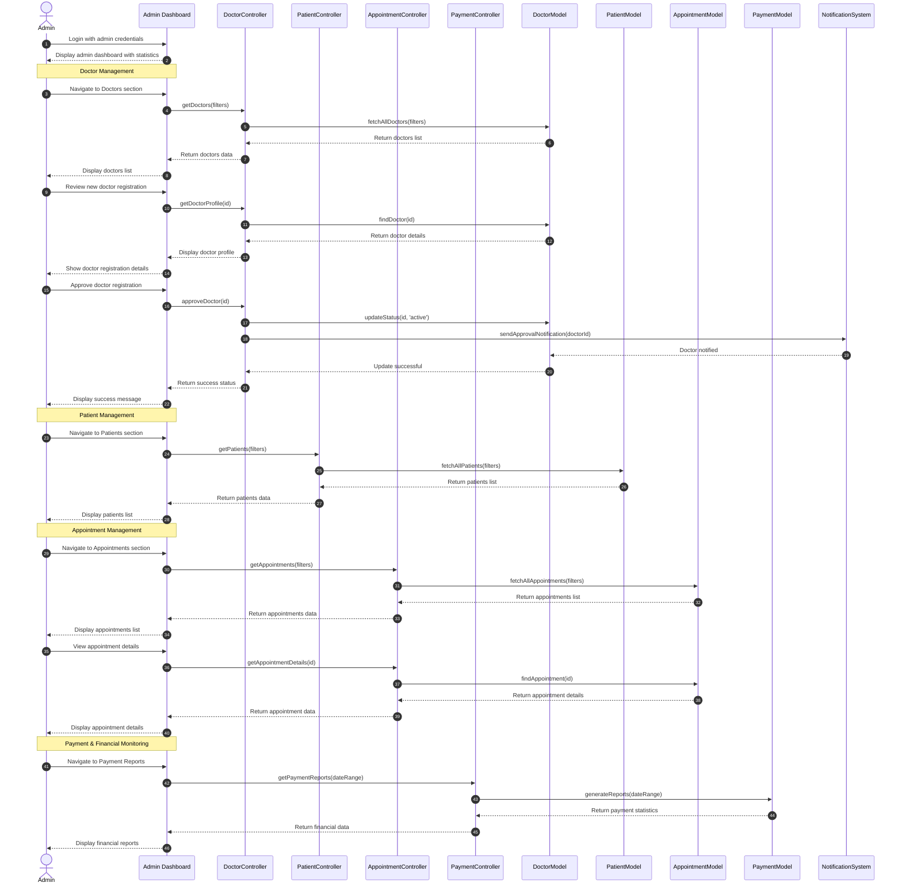

# Admin Workflow Sequence Diagram

This diagram visualizes the key administrative workflows in our clinic management system, focusing on the system administrator's perspective.

## Diagram Explanation

This sequence diagram illustrates the key administrative workflows in our clinic system, focusing on the system administrator's responsibilities:

### Key Admin Workflows:

1. **Dashboard Overview**
   - Admin logs in and views system statistics
   - Dashboard provides a comprehensive view of clinic operations

2. **Doctor Management**
   - Viewing and filtering the list of doctors
   - Reviewing new doctor registrations
   - Approving doctor profiles
   - Managing doctor verification and status

3. **Patient Management**
   - Accessing and filtering patient records
   - Overseeing patient information
   - Monitoring patient activities

4. **Appointment Management**
   - Viewing all appointments across the clinic
   - Accessing detailed information about specific appointments
   - Monitoring appointment statuses (scheduled, completed, cancelled)

5. **Financial Monitoring**
   - Accessing payment reports and financial statistics
   - Viewing transaction history
   - Generating financial reports for specific date ranges

### Administrative Capabilities:
- User management (doctors, patients, staff)
- Content management (medical specialties, services)
- System configuration and settings
- Notification management
- Role and permission management
- Reporting and analytics

This workflow ensures proper oversight of the clinic operations, maintaining high-quality healthcare service delivery while ensuring proper record-keeping and administration.
