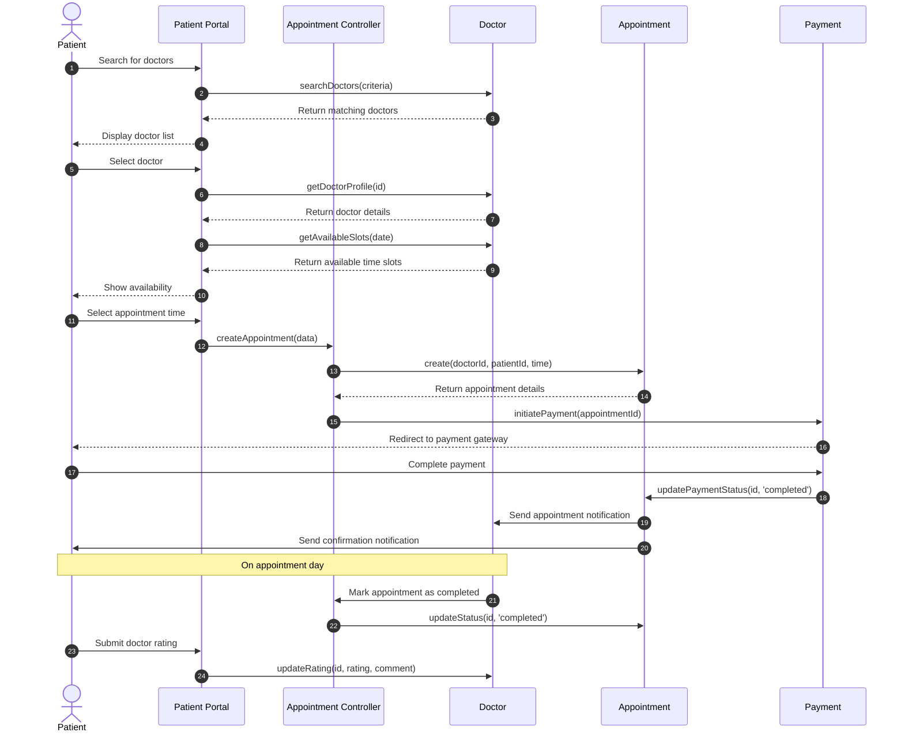

# Appointment Booking Sequence Diagram

This diagram visualizes the appointment booking process in our clinic management system, showing interactions between patients, doctors, and the system components.

## Diagram Explanation

This sequence diagram illustrates the complete appointment booking workflow in our clinic system, from doctor search to post-appointment rating:

### Key Steps:
1. **Doctor Search & Selection**
   - Patient searches for doctors based on criteria (specialty, location, etc.)
   - System displays matching doctors
   - Patient selects a doctor to view their profile and availability

2. **Appointment Booking**
   - Patient selects a convenient date and time slot
   - System creates an appointment record
   - Patient is redirected to the payment process

3. **Payment Processing**
   - Patient completes the payment
   - System updates the appointment payment status
   - Confirmation notifications are sent to both patient and doctor

4. **Appointment Completion & Feedback**
   - Doctor marks the appointment as completed after the consultation
   - Patient provides a rating and feedback about the doctor's service

### Key Interactions:
- The Patient Portal serves as the user interface for patients
- The Appointment Controller handles the business logic
- The Doctor component manages doctor information and availability
- The Appointment component stores appointment details
- The Payment component handles the financial transaction

This workflow ensures a smooth appointment booking experience while maintaining proper record-keeping and communication between all parties involved.
