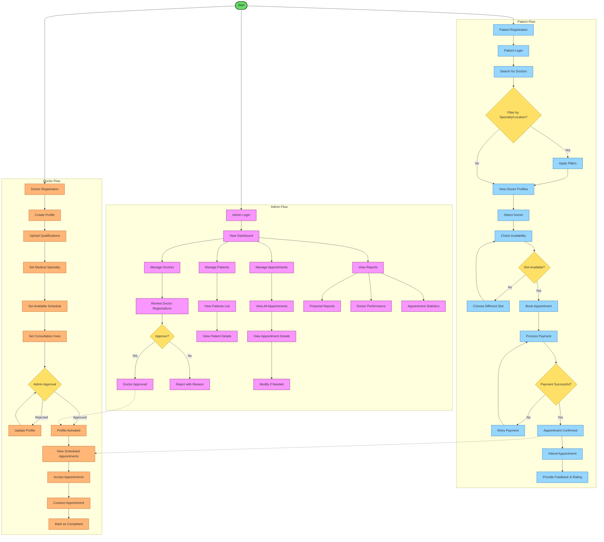

# Clinic Management System - Activity Diagram

This diagram visualizes the main workflows and activities in our clinic management system, focusing on the three primary user roles: Patient, Doctor, and Admin.

## Diagram Explanation

This activity diagram illustrates the key workflows across all user roles in our clinic management system:

### Patient Flow:
1. **Registration & Authentication**
   - Patients register an account and then login to the system
   - Authentication provides secure access to patient services

2. **Doctor Discovery**
   - Patients can search for doctors based on various criteria
   - Filtering options available for specialty, location, experience, etc.
   - Detailed doctor profiles help patients make informed choices

3. **Appointment Booking**
   - Patients check doctor availability
   - Select a suitable time slot
   - Book appointment and complete payment
   - Receive confirmation of successful booking

4. **Post-Appointment**
   - Attend appointment with the doctor
   - Provide feedback and rate the doctor's service

### Doctor Flow:
1. **Registration & Profile Setup**
   - Create account with professional details
   - Upload qualification documents
   - Set specialty, schedule, and consultation fees

2. **Approval Process**
   - Profile undergoes admin review
   - Rejected profiles can be updated and resubmitted
   - Approved profiles become active and visible to patients

3. **Appointment Management**
   - View scheduled appointments
   - Accept appointment requests 
   - Conduct consultations
   - Mark appointments as completed

### Admin Flow:
1. **Dashboard & Overview**
   - Access to system dashboard with statistics
   - Manage all aspects of the clinic system

2. **User Management**
   - Review and approve doctor registrations
   - Manage patient accounts
   - Handle user-related issues

3. **Appointment Oversight**
   - View all appointments across the system
   - Access detailed information about any appointment
   - Modify appointments if necessary

4. **Reporting & Analytics**
   - Generate financial reports
   - Monitor doctor performance metrics
   - Track appointment statistics

### Connecting Workflows:
- Patient appointment bookings appear in the doctor's appointment list
- Admin approval of doctor profiles enables doctors to start receiving appointments
- System notifications connect the activities between different user roles

This diagram represents the main activities and decision points in our clinic management system, showing how the different user roles interact with the system and with each other.
