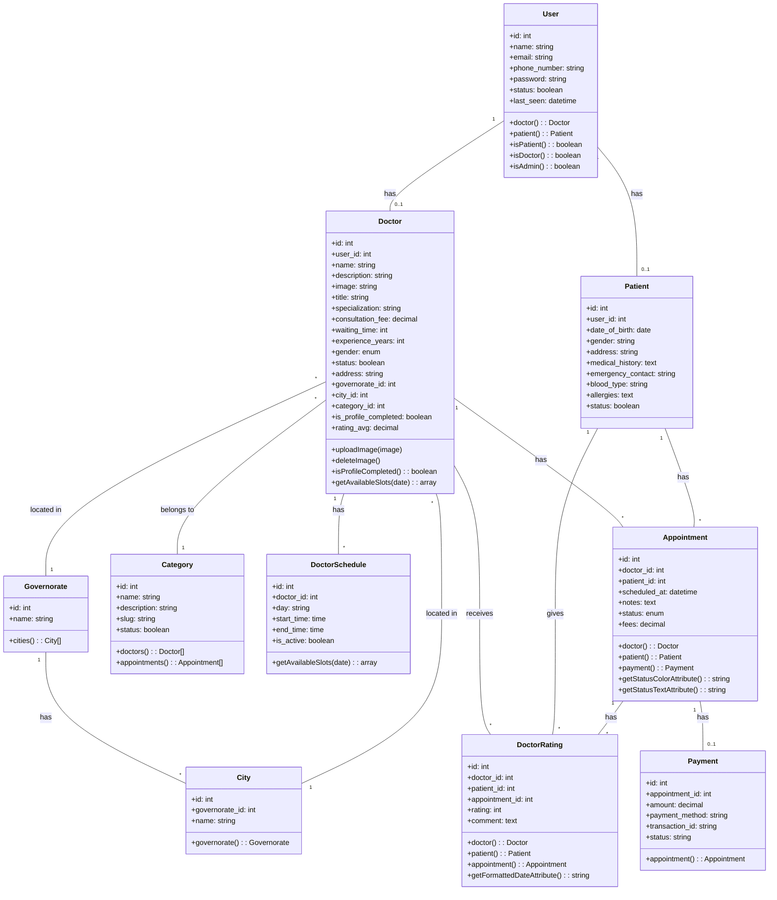

# Clinic Management System - Class Diagram

This diagram visualizes the main entities in our clinic management system and their relationships.

## Diagram Overview

This class diagram represents the core entities of our clinic management system and their relationships:

### Key Entities:
1. **User**: The base user account that can be either a doctor, patient, or admin
2. **Doctor**: Medical professionals that provide consultations
3. **Patient**: People who book appointments with doctors
4. **Appointment**: Scheduled sessions between doctors and patients
5. **Category**: Medical specialties that doctors belong to
6. **DoctorSchedule**: The available times when doctors can receive appointments
7. **DoctorRating**: Feedback provided by patients after appointments
8. **Payment**: Financial transactions for appointments
9. **Governorate & City**: Location-based entities for organizing doctors geographically

### Key Relationships:
- Users have either a Doctor profile, a Patient profile, or neither (for admins)
- Doctors belong to a specific Category (medical specialty)
- Doctors have multiple DoctorSchedules that define their availability
- Patients book Appointments with Doctors
- Patients can provide DoctorRatings after Appointments
- Each Appointment can have a Payment associated with it
- Doctors are located in specific Governorates and Cities
