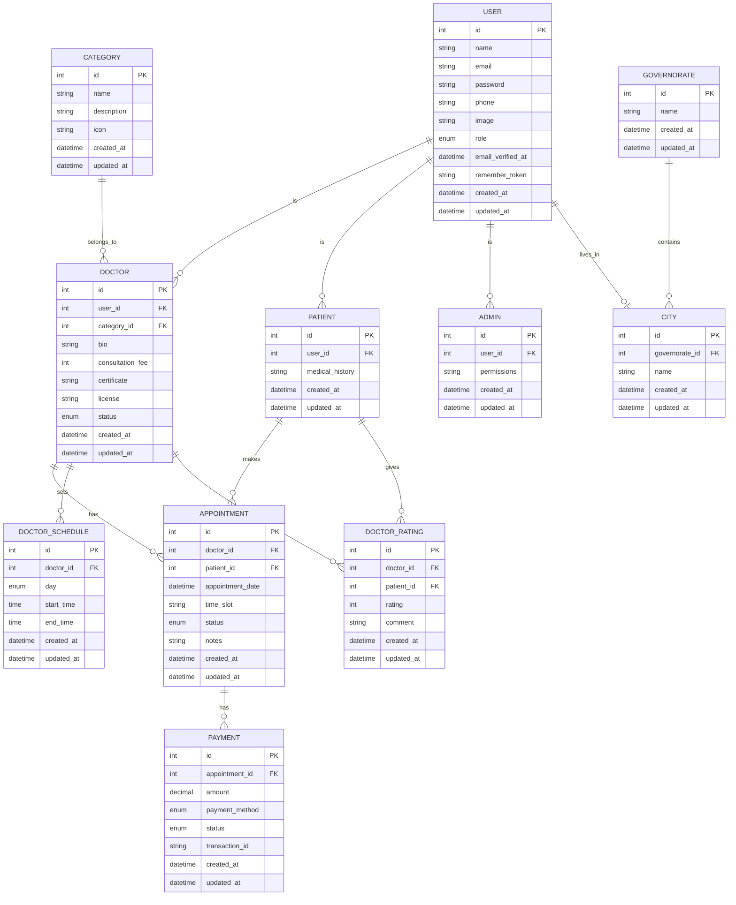

# Clinic Management System - Entity Relationship Diagram

This diagram illustrates the database structure for our Laravel-based clinic management system. It shows all entities, their relationships, and attributes.

## Diagram Explanation

This Entity Relationship Diagram (ERD) illustrates the database structure for our Laravel-based clinic management system. Here's a breakdown of the entities and their relationships:

### Core Entities

1. **USER**
   - Central entity that represents all users in the system
   - Contains common user attributes like name, email, password, etc.
   - Different user roles (doctor, patient, admin) are implemented through relationships

2. **DOCTOR**
   - Extends USER with doctor-specific information
   - Linked to medical specialty category
   - Contains professional details like consultation fees and certifications
   - Status field tracks verification/approval status

3. **PATIENT**
   - Extends USER with patient-specific information
   - Contains medical history for reference during appointments

4. **ADMIN**
   - Extends USER with admin-specific permissions
   - Manages system operations and approvals

### Appointment Management

5. **APPOINTMENT**
   - Links doctors and patients
   - Includes scheduling information and status tracking
   - Connected to payments

6. **DOCTOR_SCHEDULE**
   - Defines when doctors are available for appointments
   - Organized by days of the week and time slots

7. **PAYMENT**
   - Tracks financial transactions for appointments
   - Includes payment method, status, and transaction references

### Supporting Entities

8. **CATEGORY**
   - Represents medical specialties
   - Used to classify doctors and enable specialty-based search

9. **DOCTOR_RATING**
   - Stores feedback from patients about doctors
   - Includes numeric ratings and text comments

10. **GOVERNORATE** and **CITY**
    - Geographic location hierarchy
    - Used for location-based filtering and assignment

### Key Relationships

- A USER can be a DOCTOR, PATIENT, or ADMIN (one-to-one relationships)
- DOCTORs belong to a medical CATEGORY
- DOCTORs have multiple DOCTOR_SCHEDULEs
- PATIENTs make APPOINTMENTs with DOCTORs
- APPOINTMENTs have PAYMENT records
- USERs live in specific CITYs
- CITYs belong to GOVERNORATEs
- PATIENTs can give DOCTOR_RATINGs to DOCTORs

This database structure supports all the core functionalities of the clinic management system, including user management, appointment booking, scheduling, payments, and ratings/feedback.
