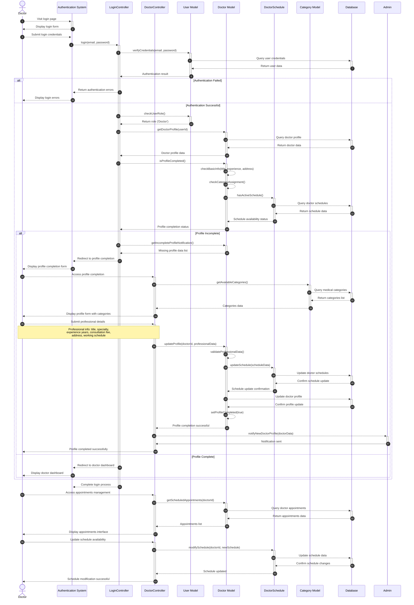

# Doctor Login Flow Sequence Diagram

This diagram visualizes the doctor login and profile verification process in our clinic management system.

## Mermaid Symbols Legend

### Arrow Types (أنواع الأسهم):
- **`-->>`** : Dashed arrow (سهم منقط) - للرسائل غير المتزامنة أو المعلوماتية
- **`->>`** : Solid arrow (سهم متصل) - للرسائل المتزامنة أو الطلبات المباشرة
- **`-->>-`** : Dashed arrow with deactivation (سهم منقط مع إنهاء التفعيل) - إرجاع النتيجة وإنهاء العملية
- **`->>+`** : Solid arrow with activation (سهم متصل مع تفعيل) - بداية عملية جديدة

### Control Flow (تحكم في التدفق):
- **`alt`** : Alternative (البديل) - يمثل شرط if/else
- **`else`** : Otherwise (وإلا) - الحالة البديلة في الشرط
- **`end`** : End block (نهاية الكتلة) - إنهاء كتلة التحكم
- **`Note over`** : Note (ملاحظة) - لإضافة معلومات توضيحية

### Activation Symbols (رموز التفعيل):
- **`+`** : Activate lifeline (تفعيل خط الحياة) - بداية معالجة في المكون
- **`-`** : Deactivate lifeline (إلغاء تفعيل خط الحياة) - انتهاء المعالجة في المكون

### Practical Examples من المخطط:
1. **`Doctor-->>+AuthSystem`** : الطبيب يرسل طلب للنظام ويبدأ تفعيله
2. **`AuthSystem-->>-Doctor`** : النظام يرد على الطبيب وينهي التفعيل
3. **`alt Authentication Failed`** : إذا فشل تسجيل الدخول
4. **`else Authentication Successful`** : وإلا إذا نجح تسجيل الدخول
5. **`DoctorModel-->>DoctorModel`** : عملية داخلية في المكون نفسه (self-call)

## Diagram Explanation

This sequence diagram illustrates the doctor login workflow in our clinic system, from authentication to profile verification and dashboard access:

### Key Components:
- **Doctor**: The healthcare professional logging into the system
- **Authentication System**: Handles user authentication and session management
- **LoginController**: Manages user login operations (`Modules\Auth\Http\Controllers\LoginController`)
- **DoctorController**: Handles doctor-specific functionality (`Modules\Doctors\Http\Controllers\DoctorsController`)
- **User Model**: Data model for user entities (`Modules\Users\Entities\User`)
- **Doctor Model**: Data model for doctor entities (`Modules\Doctors\Entities\Doctor`)
- **DoctorSchedule**: Manages doctor availability schedules (`Modules\Doctors\Entities\DoctorSchedule`)
- **Category Model**: Handles medical specialties (`Modules\Specialties\Entities\Category`)
- **Database**: Persistent data storage system
- **Admin**: System administrator for profile approval notifications

### Key Steps:

1. **Initial Authentication**
   - Doctor visits the login page and receives the login form
   - Doctor submits credentials (email and password)
   - LoginController validates credentials against database records

2. **Role Verification & Profile Check**
   - System confirms the user has 'Doctor' role
   - System retrieves doctor profile information from database
   - DoctorModel checks profile completion status by verifying:
     - Basic professional information (title, experience, address)
     - Medical specialty/category assignment
     - Active working schedule availability

3. **Profile Completion Flow (if incomplete)**
   - System redirects to profile completion interface
   - Doctor provides missing professional details:
     - Medical title (استشاري، أخصائي، طبيب)
     - Medical specialty from available categories
     - Years of experience
     - Consultation fee
     - Practice address and location
     - Weekly availability schedule
   - System validates and saves professional data
   - Admin receives notification of new doctor profile
   - Profile is marked as completed

4. **Dashboard Access (if profile complete)**
   - Doctor is redirected to personalized dashboard
   - System displays upcoming appointments and schedule
   - Doctor can access appointment management features

5. **Ongoing Operations**
   - Doctor can view and manage scheduled appointments
   - Doctor can modify availability schedule as needed
   - System maintains real-time schedule synchronization

### Interactive Lifelines:
The diagram uses activation boxes (the vertical bars) to show when each component is actively processing requests, providing a clear visual representation of the system's interaction flow and component lifecycle during the doctor login process.

### Required Information for Profile Completion:
- **Professional Details**: Medical title, specialty category, years of experience
- **Practice Information**: Consultation fees, average waiting time, practice address
- **Location Data**: Governorate and city selection
- **Schedule Management**: Weekly availability with specific time slots
- **Contact Information**: Phone number and professional description
- **Optional Data**: Profile image, medical degree information

### Key Differences from Patient Flow:
- **Role-Based Redirection**: Doctors require professional profile completion
- **Admin Notifications**: New doctor profiles trigger admin review notifications
- **Schedule Management**: Doctors must set up availability schedules
- **Professional Verification**: Additional validation for medical credentials
- **Specialty Assignment**: Doctors must be assigned to medical categories

### Note:
The system automatically checks profile completion status on each login to ensure doctors maintain up-to-date professional information. Incomplete profiles are redirected to completion forms to maintain system data integrity and patient trust. 