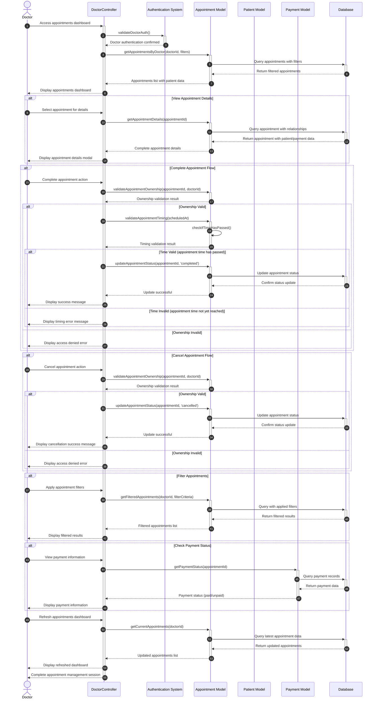

# Doctor Manage Appointments Flow Sequence Diagram

This diagram visualizes the doctor appointment management process in our clinic management system, including viewing, completing, and canceling appointments.

## Mermaid Symbols Legend

### Arrow Types (أنواع الأسهم):
- **`->>`** : Solid arrow (سهم متصل) - للطلبات والاستدعاءات (Requests/Calls)
- **`-->>`** : Dashed arrow (سهم منقط) - للاستجابات وإرجاع النتائج (Responses/Returns)
- **`->>+`** : Solid arrow with activation (سهم متصل مع تفعيل) - بداية عملية جديدة
- **`-->>-`** : Dashed arrow with deactivation (سهم منقط مع إنهاء التفعيل) - إرجاع النتيجة وإنهاء العملية

### Control Flow (تحكم في التدفق):
- **`alt`** : Alternative (البديل) - يمثل شرط if/else
- **`else`** : Otherwise (وإلا) - الحالة البديلة في الشرط  
- **`end`** : End block (نهاية الكتلة) - إنهاء كتلة التحكم

### Activation Symbols (رموز التفعيل):
- **`+`** : Activate lifeline (تفعيل خط الحياة) - بداية معالجة في المكون
- **`-`** : Deactivate lifeline (إلغاء تفعيل خط الحياة) - انتهاء المعالجة في المكون

### Practical Examples من المخطط:
1. **`Doctor->>+DoctorController`** : الطبيب يرسل طلب للكنترولر ويبدأ تفعيله (Request)
2. **`DoctorController-->>Doctor`** : الكنترولر يرد على الطبيب (Response)
3. **`alt View Appointment Details`** : إذا اختار الطبيب عرض تفاصيل الحجز
4. **`AppointmentModel->>AppointmentModel`** : عملية داخلية في نفس المكون (self-call)
5. **`Database-->>-AppointmentModel`** : إرجاع البيانات وإنهاء التفعيل

## Diagram Explanation

This sequence diagram illustrates the doctor appointment management workflow in our clinic system, covering all major appointment operations:

### Key Components:
- **Doctor**: The healthcare professional managing appointments
- **DoctorController**: Main controller handling doctor operations (`Modules\Doctors\Http\Controllers\DoctorsController`)
- **Authentication System**: Validates doctor access and permissions
- **Appointment Model**: Data model for appointment entities (`Modules\Appointments\Entities\Appointment`)
- **Patient Model**: Data model for patient information (`Modules\Patients\Entities\Patient`)
- **Payment Model**: Handles payment status and information (`Modules\Payments\Entities\Payment`)
- **Database**: Persistent data storage system

### Key Workflows:

1. **Dashboard Access & Filtering**
   - Doctor accesses the appointments dashboard
   - System validates doctor authentication and permissions
   - Appointments are retrieved with optional filters (status, date, patient name, payment status)
   - Dashboard displays organized appointment information with filtering capabilities

2. **Appointment Details Viewing**
   - Doctor selects specific appointment for detailed view
   - System retrieves complete appointment information including patient details and payment status
   - Modal displays comprehensive appointment information

3. **Complete Appointment Flow**
   - Doctor initiates appointment completion
   - System validates appointment ownership and timing constraints
   - Only appointments whose scheduled time has passed can be completed
   - Status is updated to 'completed' in database
   - Success confirmation is displayed to doctor

4. **Cancel Appointment Flow**
   - Doctor initiates appointment cancellation
   - System validates appointment ownership
   - Appointment status is updated to 'cancelled'
   - Cancellation confirmation is displayed to doctor

5. **Payment Status Monitoring**
   - Doctor can view payment information for appointments
   - System retrieves payment status from Stripe integration
   - Payment details including method and transaction ID are displayed

6. **Real-time Dashboard Updates**
   - Dashboard can be refreshed to show latest appointment status
   - Filters can be applied for specific appointment searches
   - System maintains real-time synchronization with database

### Interactive Features:
- **Advanced Filtering**: By status, date range, patient name, appointment ID, and payment status
- **Bulk Operations**: Viewing multiple appointments with status indicators
- **Real-time Updates**: Dashboard reflects immediate changes after actions

### Security & Validation:
- **Ownership Validation**: Ensures doctors can only manage their own appointments
- **Timing Constraints**: Prevents completing appointments before scheduled time
- **Authentication Checks**: Continuous validation of doctor permissions
- **Error Handling**: Comprehensive error messages for various failure scenarios

### Status Management:
The system handles three appointment statuses:
- **Scheduled** (قيد الانتظار): Active appointments awaiting completion
- **Completed** (مكتمل): Successfully finished appointments
- **Cancelled** (ملغي): Cancelled appointments

### Integration Points:
- **Payment System**: Real-time payment status from Stripe
- **Patient Management**: Access to patient information and contact details  
- **Schedule Management**: Integration with doctor availability schedules

### Note:
The system ensures data integrity through transaction management and provides comprehensive audit trails for all appointment status changes. Patient notifications are handled by background services separate from the doctor workflow. 
