# Doctor Manage Schedule Slots Flow Sequence Diagram

This diagram visualizes the doctor schedule slots management process in our clinic management system, including viewing, creating, updating, and managing weekly availability.

```mermaid
sequenceDiagram
    autonumber
    actor Doctor
    participant DoctorController
    participant AuthSystem as Authentication System  
    participant DoctorModel as Doctor Model
    participant DoctorSchedule
    participant SlotGenerator as Slot Generator
    participant AppointmentModel as Appointment Model
    participant Database
    participant ValidationSystem as Validation System
    
    Doctor-->>+DoctorController: Access profile schedule section
    DoctorController-->>+AuthSystem: validateDoctorAuth()
    AuthSystem-->>-DoctorController: Doctor authentication confirmed
    
    DoctorController-->>+DoctorModel: getDoctorProfile(doctorId)
    DoctorModel-->>+Database: Query doctor information
    Database-->>-DoctorModel: Return doctor data
    DoctorModel-->>-DoctorController: Doctor profile data
    
    DoctorController-->>+DoctorSchedule: getCurrentSchedules(doctorId)
    DoctorSchedule-->>+Database: Query existing schedules
    Database-->>-DoctorSchedule: Return weekly schedule data
    DoctorSchedule-->>-DoctorController: Current schedule configuration
    
    DoctorController-->>Doctor: Display weekly schedule interface
    Note over Doctor,DoctorController: Shows: 7-day table with<br/>availability checkboxes and time inputs
    
    alt View Current Schedule
        Doctor-->>DoctorController: Request schedule overview
        DoctorController-->>+DoctorSchedule: getWeeklyAvailability(doctorId)
        DoctorSchedule-->>+Database: Query all active schedules
        Database-->>-DoctorSchedule: Return schedule details
        DoctorSchedule-->>-DoctorController: Weekly availability data
        DoctorController-->>Doctor: Display schedule overview
        Note over Doctor,DoctorController: Shows: active days, time ranges,<br/>total available hours per week
    end
    
    alt Configure Day Availability
        Doctor-->>DoctorController: Toggle day availability
        DoctorController-->>+ValidationSystem: validateDaySelection(dayName)
        ValidationSystem-->>-DoctorController: Day validation result
        
        alt Day Enabled
            Doctor-->>DoctorController: Set start time
            Doctor-->>DoctorController: Set end time
            
            DoctorController-->>+ValidationSystem: validateTimeRange(startTime, endTime)
            ValidationSystem-->>ValidationSystem: checkTimeLogic(start < end)
            ValidationSystem-->>ValidationSystem: checkBusinessHours(8AM-6PM)
            ValidationSystem-->>-DoctorController: Time validation result
            
            alt Valid Time Range
                DoctorController-->>+SlotGenerator: generateTimeSlots(startTime, endTime, interval=30min)
                SlotGenerator-->>SlotGenerator: calculateSlots(30minute intervals)
                SlotGenerator-->>-DoctorController: Available time slots list
                DoctorController-->>Doctor: Display preview of generated slots
                Note over Doctor,DoctorController: Shows: 30-minute intervals<br/>from start to end time
            else Invalid Time Range
                DoctorController-->>Doctor: Display time validation error
                Note over Doctor,DoctorController: Error: "End time must be after start time"
            end
        else Day Disabled
            DoctorController-->>DoctorController: clearDayTimeInputs()
            DoctorController-->>Doctor: Disable time input fields
        end
    end
    
    alt Update Schedule Configuration
        Doctor-->>DoctorController: Submit schedule changes
        DoctorController-->>+ValidationSystem: validateCompleteSchedule(scheduleData)
        ValidationSystem-->>ValidationSystem: checkMinimumWorkingDays()
        ValidationSystem-->>ValidationSystem: validateAllTimeRanges()
        ValidationSystem-->>-DoctorController: Schedule validation result
        
        alt Schedule Valid
            DoctorController-->>+DoctorModel: updateSchedule(doctorId, newScheduleData)
            DoctorModel-->>+DoctorSchedule: deleteExistingSchedules(doctorId)
            DoctorSchedule-->>+Database: Delete current doctor schedules
            Database-->>-DoctorSchedule: Confirm schedule deletion
            DoctorSchedule-->>-DoctorModel: Deletion confirmed
            
            DoctorModel-->>+DoctorSchedule: createNewSchedules(scheduleData)
            loop For each enabled day
                DoctorSchedule-->>+Database: Insert schedule record
                Note over DoctorSchedule,Database: Insert: doctor_id, day,<br/>start_time, end_time, is_active=true
                Database-->>-DoctorSchedule: Confirm schedule creation
            end
            DoctorSchedule-->>-DoctorModel: All schedules created
            DoctorModel-->>-DoctorController: Schedule update successful
            
            DoctorController-->>Doctor: Display success message
            DoctorController-->>Doctor: Refresh schedule display
        else Schedule Invalid
            DoctorController-->>Doctor: Display validation errors
            Note over Doctor,DoctorController: Errors: missing times,<br/>conflicting schedules, minimum days
        end
    end
    
    alt Check Slot Availability
        Doctor-->>DoctorController: Preview available slots for date
        DoctorController-->>+DoctorModel: getAvailableSlots(doctorId, selectedDate)
        DoctorModel-->>+DoctorSchedule: getScheduleForDay(dayOfWeek)
        DoctorSchedule-->>+Database: Query day schedule
        Database-->>-DoctorSchedule: Return day schedule
        DoctorSchedule-->>-DoctorModel: Day schedule data
        
        DoctorModel-->>+SlotGenerator: generateDaySlots(schedule, date)
        SlotGenerator-->>SlotGenerator: createTimeSlots(30min intervals)
        SlotGenerator-->>-DoctorModel: Generated time slots
        
        DoctorModel-->>+AppointmentModel: getBookedSlots(doctorId, date)
        AppointmentModel-->>+Database: Query scheduled appointments
        Database-->>-AppointmentModel: Return booked appointments
        AppointmentModel-->>-DoctorModel: Booked time slots
        
        DoctorModel-->>DoctorModel: filterAvailableSlots(generated - booked)
        DoctorModel-->>-DoctorController: Available slots for date
        DoctorController-->>Doctor: Display available slots preview
        Note over Doctor,DoctorController: Shows: available slots count,<br/>next available time, booking capacity
    end
    
    alt Bulk Schedule Operations
        Doctor-->>DoctorController: Apply template to multiple days
        DoctorController-->>+ValidationSystem: validateScheduleTemplate(templateData)
        ValidationSystem-->>-DoctorController: Template validation result
        
        alt Template Valid
            DoctorController-->>+DoctorModel: applyScheduleTemplate(doctorId, template, selectedDays)
            loop For each selected day
                DoctorModel-->>+DoctorSchedule: updateDaySchedule(day, templateTimes)
                DoctorSchedule-->>+Database: Update/Create day schedule
                Database-->>-DoctorSchedule: Confirm day update
                DoctorSchedule-->>-DoctorModel: Day updated
            end
            DoctorModel-->>-DoctorController: Bulk update successful
            DoctorController-->>Doctor: Display bulk update success
        else Template Invalid
            DoctorController-->>Doctor: Display template validation error
        end
    end
    
    Doctor-->>DoctorController: Save final schedule configuration
    DoctorController-->>+DoctorModel: finalizeScheduleChanges(doctorId)
    DoctorModel-->>DoctorModel: updateProfileCompletionStatus()
    DoctorModel-->>+Database: Update doctor profile completion
    Database-->>-DoctorModel: Confirm profile update
    DoctorModel-->>-DoctorController: Schedule finalization complete
    DoctorController-->>Doctor: Display final confirmation
    DoctorController-->>-Doctor: Complete schedule management session
    
```



## Mermaid Symbols Legend

### Arrow Types (أنواع الأسهم):
- **`-->>`** : Dashed arrow (سهم منقط) - للرسائل غير المتزامنة أو المعلوماتية
- **`->>`** : Solid arrow (سهم متصل) - للرسائل المتزامنة أو الطلبات المباشرة
- **`-->>-`** : Dashed arrow with deactivation (سهم منقط مع إنهاء التفعيل) - إرجاع النتيجة وإنهاء العملية
- **`->>+`** : Solid arrow with activation (سهم متصل مع تفعيل) - بداية عملية جديدة

### Control Flow (تحكم في التدفق):
- **`alt`** : Alternative (البديل) - يمثل شرط if/else
- **`else`** : Otherwise (وإلا) - الحالة البديلة في الشرط
- **`end`** : End block (نهاية الكتلة) - إنهاء كتلة التحكم
- **`loop`** : Loop block (حلقة تكرار) - للعمليات المتكررة
- **`Note over`** : Note (ملاحظة) - لإضافة معلومات توضيحية

### Activation Symbols (رموز التفعيل):
- **`+`** : Activate lifeline (تفعيل خط الحياة) - بداية معالجة في المكون
- **`-`** : Deactivate lifeline (إلغاء تفعيل خط الحياة) - انتهاء المعالجة في المكون

### Practical Examples من المخطط:
1. **`Doctor-->>+DoctorController`** : الطبيب يرسل طلب للكنترولر ويبدأ تفعيله
2. **`loop For each enabled day`** : حلقة تكرار لكل يوم مفعل في الجدول
3. **`alt Day Enabled`** : إذا تم تفعيل اليوم في الجدول
4. **`Note over Doctor,DoctorController`** : ملاحظة توضيحية عبر عدة مكونات

## Diagram Explanation

This sequence diagram illustrates the doctor schedule slots management workflow in our clinic system, covering all aspects of weekly availability management:

### Key Components:
- **Doctor**: The healthcare professional managing their schedule
- **DoctorController**: Main controller handling doctor operations (`Modules\Doctors\Http\Controllers\DoctorsController`)
- **Authentication System**: Validates doctor access and permissions
- **Doctor Model**: Data model for doctor entities (`Modules\Doctors\Entities\Doctor`)
- **DoctorSchedule**: Manages doctor schedule data (`Modules\Doctors\Entities\DoctorSchedule`)
- **Slot Generator**: Generates available time slots with 30-minute intervals
- **Appointment Model**: Handles existing appointment data for slot availability
- **Database**: Persistent data storage system
- **Validation System**: Validates schedule data and business rules

### Key Workflows:

1. **Schedule Interface Access**
   - Doctor accesses profile schedule management section
   - System validates authentication and retrieves current schedule configuration
   - Weekly schedule interface is displayed with 7-day availability table

2. **Current Schedule Viewing**
   - System retrieves existing schedule configuration from database
   - Displays weekly overview showing active days, time ranges, and total availability
   - Provides schedule statistics and availability summary

3. **Day Availability Configuration**
   - Doctor can enable/disable specific days of the week
   - When day is enabled, time input fields are activated
   - System validates time ranges (start < end, business hours 8AM-6PM)
   - Preview of generated 30-minute slots is displayed

4. **Schedule Update Process**
   - Complete schedule validation (minimum working days, time conflicts)
   - Atomic database operations: delete existing schedules then create new ones
   - Transaction-based approach ensures data consistency
   - Success confirmation and schedule refresh

5. **Slot Availability Preview**
   - Generate available time slots for specific dates
   - Cross-reference with existing appointments to show actual availability
   - Display booking capacity and next available appointment slots
   - Real-time availability calculation

6. **Bulk Schedule Operations**
   - Apply schedule templates to multiple days
   - Batch updates for consistent weekly patterns
   - Template validation and bulk database operations

### Schedule Management Features:

#### **Time Slot Generation**
- **Fixed Intervals**: 30-minute appointment slots
- **Business Hours**: 8:00 AM to 6:00 PM constraint
- **Dynamic Generation**: Real-time slot calculation based on schedule
- **Conflict Avoidance**: Automatic filtering of booked time slots

#### **Validation Rules**
- **Time Logic**: End time must be after start time
- **Business Hours**: Working hours within clinic operating times
- **Minimum Availability**: At least one working day required
- **Schedule Conflicts**: Prevention of overlapping appointments

#### **Database Operations**
- **Atomic Updates**: Complete schedule replacement for consistency
- **Transaction Safety**: Rollback capability for failed updates
- **Index Optimization**: Fast lookups by doctor_id and day
- **Cascade Deletion**: Automatic cleanup of related schedules

#### **User Interface Features**
- **Interactive Table**: 7-day schedule configuration grid
- **Real-time Validation**: Immediate feedback on time input
- **Slot Preview**: Visual representation of generated availability
- **Bulk Operations**: Template application and multi-day updates

### Integration Points:

#### **Appointment System Integration**
- **Real-time Availability**: Cross-reference with booked appointments
- **Slot Filtering**: Remove booked times from available slots
- **Booking Validation**: Ensure appointments match doctor availability

#### **Profile Completion**
- **Completion Status**: Schedule setup affects profile completion
- **Business Logic**: Minimum schedule requirements for active profile
- **Patient Visibility**: Complete schedules enable patient booking

#### **API Endpoints**
- **Available Slots**: `/appointments/available-slots` endpoint
- **Doctor Days**: `/appointments/doctor-available-days` endpoint
- **JSON Responses**: Structured data for frontend integration

### Technical Implementation:

#### **Schedule Data Model**
```sql
doctor_schedules:
- id, doctor_id, day, start_time, end_time, is_active
- Indexed by (doctor_id, day) for performance
```

#### **Slot Generation Algorithm**
- Parse schedule start/end times for specified day
- Generate 30-minute intervals within time range
- Filter out times with existing scheduled appointments
- Return available slots array for booking interface

#### **Validation Logic**
- Server-side validation for all schedule modifications
- Client-side JavaScript for immediate user feedback
- Business rule enforcement at database and application levels

### Note:
The system ensures schedule integrity through comprehensive validation and atomic database operations. All schedule changes immediately affect patient booking availability, maintaining real-time synchronization between doctor availability and appointment booking system. 