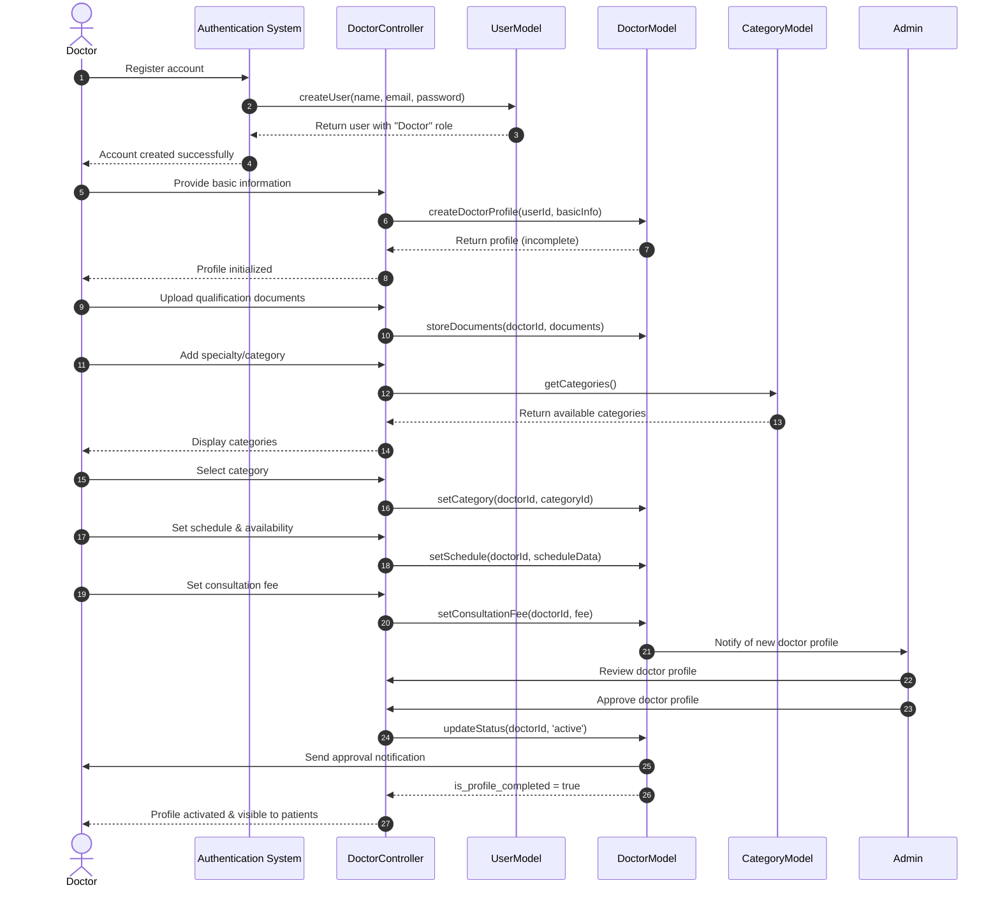

# Doctor Registration Sequence Diagram

This diagram visualizes the doctor registration and profile completion process in our clinic management system.

## Diagram Explanation

This sequence diagram illustrates the doctor onboarding workflow in our clinic system, from registration to profile activation:

### Key Steps:
1. **Account Registration**
   - Doctor creates a user account in the system
   - Authentication system assigns the "Doctor" role

2. **Profile Creation**
   - Doctor provides basic personal and professional information
   - System initializes an incomplete doctor profile

3. **Profile Completion**
   - Doctor uploads qualification documents and certifications
   - Doctor selects their medical specialty/category
   - Doctor sets their availability schedule
   - Doctor establishes their consultation fee

4. **Admin Review & Approval**
   - Admin is notified about the new doctor profile
   - Admin reviews the profile and submitted documents
   - Admin approves the doctor if qualifications are satisfactory
   - System marks the doctor profile as completed and active

5. **Activation**
   - Doctor receives approval notification
   - Doctor profile becomes visible to patients for appointment booking

### Required Information for Profile Completion:
- Basic personal details (name, contact information)
- Professional qualifications and experience
- Medical specialty/category
- Weekly schedule with available time slots
- Consultation fee
- Profile image and other supporting documents

The system tracks profile completion status to ensure all doctors have provided the necessary information before their profiles are visible to patients.
