# Patient Appointment Booking and Payment Sequence Diagram

This diagram visualizes the patient appointment booking process in our clinic management system.

```mermaid
sequenceDiagram
    autonumber
    actor Patient
    participant BookingPage as Booking Page
    participant AppointmentsController
    participant Doctor as Doctor Model
    participant PatientModel as Patient Model
    participant Appointment as Appointment Model
    participant Payment as Payment Model
    participant StripeAPI as Stripe API
    participant Database
    
    Patient-->>+BookingPage: Visit doctor booking page
    BookingPage-->>+AppointmentsController: book(doctorId)
    
    alt User Not Authenticated
        AppointmentsController-->>BookingPage: Redirect to login
        BookingPage-->>Patient: Login required message
    else User Authenticated
        AppointmentsController-->>+Doctor: getDoctorDetails(doctorId)
        Doctor-->>+Database: Query doctor profile
        Database-->>-Doctor: Return doctor data
        Doctor-->>-AppointmentsController: Doctor profile with fees
        AppointmentsController-->>BookingPage: Doctor details & booking form
        BookingPage-->>Patient: Display booking form with doctor info
    end
    
    AppointmentsController-->>-BookingPage: Initial process completed
    BookingPage-->>-Patient: Page ready
    
    Patient-->>+BookingPage: Submit appointment form (date, time, notes)
    BookingPage-->>+AppointmentsController: store(appointmentData)
    
    alt Patient Profile Incomplete
        AppointmentsController-->>+PatientModel: checkPatientProfile(userId)
        PatientModel-->>+Database: Query patient record
        Database-->>-PatientModel: Return patient data
        PatientModel-->>-AppointmentsController: Patient profile not found/incomplete
        AppointmentsController-->>BookingPage: Profile completion required
        BookingPage-->>Patient: Complete profile first message
    else Patient Profile Complete
        AppointmentsController-->>+Doctor: validateAvailability(doctorId, datetime)
        Doctor-->>+Database: Check doctor schedule & conflicts
        Database-->>-Doctor: Return availability status
        Doctor-->>-AppointmentsController: Availability confirmed
        
        AppointmentsController-->>+Appointment: create(appointmentData)
        Appointment-->>Appointment: setFees(doctor.consultation_fee)
        Appointment-->>Appointment: setStatus('scheduled')
        Appointment-->>+Database: Insert new appointment
        Database-->>-Appointment: Confirm appointment creation
        Appointment-->>-AppointmentsController: Created appointment
        
        AppointmentsController-->>BookingPage: Appointment created successfully
        BookingPage-->>Patient: Display success message with payment option
    end
    
    Patient-->>+BookingPage: Choose to pay now
    BookingPage-->>+AppointmentsController: initiatePayment(appointmentId)
    AppointmentsController-->>+StripeAPI: createCheckoutSession(appointmentData)
    
    alt Stripe Session Creation Failed
        StripeAPI-->>AppointmentsController: API Error
        AppointmentsController-->>BookingPage: Payment session failed
        BookingPage-->>Patient: Error message - try again later
    else Stripe Session Created Successfully
        StripeAPI-->>AppointmentsController: Checkout session URL
        AppointmentsController-->>BookingPage: Redirect to Stripe
        BookingPage-->>Patient: Redirect to Stripe checkout
        
        Patient-->>StripeAPI: Complete payment on Stripe
        StripeAPI-->>StripeAPI: Process payment
        
        alt Payment Successful
            StripeAPI-->>Patient: Payment success - redirect back
            Patient-->>BookingPage: Return to success page
            BookingPage-->>+AppointmentsController: handlePaymentSuccess(sessionId)
            
            AppointmentsController-->>+Payment: create(paymentData)
            Payment-->>Payment: generateTransactionId()
            Payment-->>Payment: setStatus('completed')
            Payment-->>+Database: Insert payment record
            Database-->>-Payment: Payment record created
            Payment-->>-AppointmentsController: Payment confirmation
            
            AppointmentsController-->>-BookingPage: Payment completed successfully
            BookingPage-->>Patient: Payment success confirmation
            
        else Payment Failed
            StripeAPI-->>Patient: Payment failed - redirect back
            Patient-->>BookingPage: Return to failure page
            BookingPage-->>+AppointmentsController: handlePaymentFailure(appointmentId)
            
            AppointmentsController-->>+Payment: create(failedPaymentData)
            Payment-->>Payment: setStatus('failed')
            Payment-->>+Database: Insert failed payment record
            Database-->>-Payment: Failed payment recorded
            Payment-->>-AppointmentsController: Failure recorded
            
            AppointmentsController-->>-BookingPage: Payment failed - appointment still valid
            BookingPage-->>Patient: Payment failure with retry option
        end
    end
    
    StripeAPI-->>-AppointmentsController: End Stripe process
    
    AppointmentsController-->>-BookingPage: Payment process completed
    BookingPage-->>-Patient: End payment process
    
    Patient-->>+BookingPage: View appointment details
    BookingPage-->>+AppointmentsController: show(appointmentId)
    AppointmentsController-->>+Appointment: getAppointmentDetails(appointmentId)
    Appointment-->>+Database: Query appointment with relations
    Database-->>-Appointment: Return appointment data
    Appointment-->>-AppointmentsController: Appointment details
    AppointmentsController-->>-BookingPage: Appointment information
    BookingPage-->>-Patient: Display appointment details
    
    Patient-->>+BookingPage: Cancel appointment (if needed)
    BookingPage-->>+AppointmentsController: cancel(appointmentId)
    AppointmentsController-->>+Appointment: updateStatus('cancelled')
    Appointment-->>+Database: Update appointment status
    Database-->>-Appointment: Status updated
    Appointment-->>-AppointmentsController: Cancellation confirmed
    
    AppointmentsController-->>-BookingPage: Appointment cancelled
    BookingPage-->>-Patient: Cancellation confirmation
    
```

## Mermaid Symbols Legend

### Arrow Types (أنواع الأسهم):
- **`-->>`** : Dashed arrow (سهم منقط) - للرسائل غير المتزامنة أو المعلوماتية
- **`->>`** : Solid arrow (سهم متصل) - للرسائل المتزامنة أو الطلبات المباشرة
- **`-->>-`** : Dashed arrow with deactivation (سهم منقط مع إنهاء التفعيل) - إرجاع النتيجة وإنهاء العملية
- **`->>+`** : Solid arrow with activation (سهم متصل مع تفعيل) - بداية عملية جديدة

### Control Flow (تحكم في التدفق):
- **`alt`** : Alternative (البديل) - يمثل شرط if/else
- **`else`** : Otherwise (وإلا) - الحالة البديلة في الشرط
- **`end`** : End block (نهاية الكتلة) - إنهاء كتلة التحكم

### Activation Symbols (رموز التفعيل):
- **`+`** : Activate lifeline (تفعيل خط الحياة) - بداية معالجة في المكون
- **`-`** : Deactivate lifeline (إلغاء تفعيل خط الحياة) - انتهاء المعالجة في المكون

### Practical Examples من المخطط:
1. **`Patient-->>+BookingPage`** : المريض يطلب صفحة الحجز ويبدأ تفعيلها
2. **`BookingPage-->>-Patient`** : الصفحة ترد على المريض وتنهي التفعيل
3. **`alt User Not Authenticated`** : إذا لم يكن المستخدم مسجل دخول (في بداية الزيارة)
4. **`else User Authenticated`** : وإلا إذا كان المستخدم مسجل دخول
5. **`alt Patient Profile Incomplete`** : إذا كان ملف المريض غير مكتمل (عند إرسال النموذج)
6. **`else Patient Profile Complete`** : وإلا إذا كان ملف المريض مكتمل
7. **`alt Payment Successful`** : إذا نجحت عملية الدفع
8. **`else Payment Failed`** : وإلا إذا فشلت عملية الدفع
9. **`Appointment-->>Appointment`** : عملية داخلية في نموذج الموعد

## Diagram Explanation

This sequence diagram illustrates the patient appointment booking workflow in our clinic system:

### Key Components:
- **Patient**: The end user booking an appointment
- **Booking Page**: The frontend booking interface (`Modules\Appointments\Resources\views\book.blade.php`)
- **AppointmentsController**: Handles appointment operations (`Modules\Appointments\Http\Controllers\AppointmentsController`)
- **Doctor Model**: Data model for doctor entities (`Modules\Doctors\Entities\Doctor`)
- **Patient Model**: Data model for patient entities (`Modules\Patients\Entities\Patient`)
- **Appointment Model**: Data model for appointment entities (`Modules\Appointments\Entities\Appointment`)
- **Payment Model**: Data model for payment entities (`Modules\Payments\Entities\Payment`)
- **Stripe API**: External payment processing service
- **Database**: Persistent data storage system

### Key Steps:

1. **Initial Authentication Check**
   - Patient visits the doctor's booking page
   - System first checks if user is authenticated
   - If not authenticated, redirects to login page
   - If authenticated, loads doctor details and booking form

2. **Profile Validation (During Form Submission)**
   - When patient submits appointment form, system validates profile
   - Verifies user has a complete patient profile (checks if `$user->patient` exists)
   - Redirects to profile completion if needed

3. **Appointment Creation**
   - System validates appointment data (date, time, notes)
   - Checks doctor availability for the requested slot
   - Creates new appointment with 'scheduled' status
   - Automatically sets consultation fees from doctor profile

4. **Payment Processing (Optional)**
   - Patient can choose to pay immediately after booking
   - System creates Stripe checkout session with appointment metadata
   - Patient completes payment on secure Stripe platform
   - System records payment status and generates transaction ID

5. **Appointment Management**
   - Patient can view appointment details
   - Patient can cancel appointments if needed
   - System updates appointment status accordingly

### Appointment Statuses:
- **scheduled**: Initial appointment status (في الانتظار)
- **completed**: Appointment finished (مكتمل)
- **cancelled**: Appointment cancelled (ملغي)

### Payment Statuses:
- **pending**: Payment initiated but not completed (معلق)
- **completed**: Payment successfully processed (مكتمل)
- **failed**: Payment failed or cancelled (فاشل)

### Required Information for Booking:
- **Doctor Selection**: Must select an available doctor
- **Date & Time**: Must be future date with available slot
- **Patient Profile**: Complete patient profile required
- **Notes**: Optional additional information
- **Consultation Fee**: Automatically calculated from doctor's fee

### Validation Rules:
- User must be authenticated
- User must have complete patient profile
- Appointment date must be today or future
- Time slot must be available
- Doctor must be active and available

### Interactive Features:
- Real-time availability checking
- Automatic fee calculation
- Profile completion prompts
- Appointment status tracking
- Integrated payment processing with Stripe
- Payment retry functionality for failed transactions
- Secure payment session management

The system ensures data integrity by validating all inputs and checking availability before creating appointments, providing a reliable booking experience for patients. 