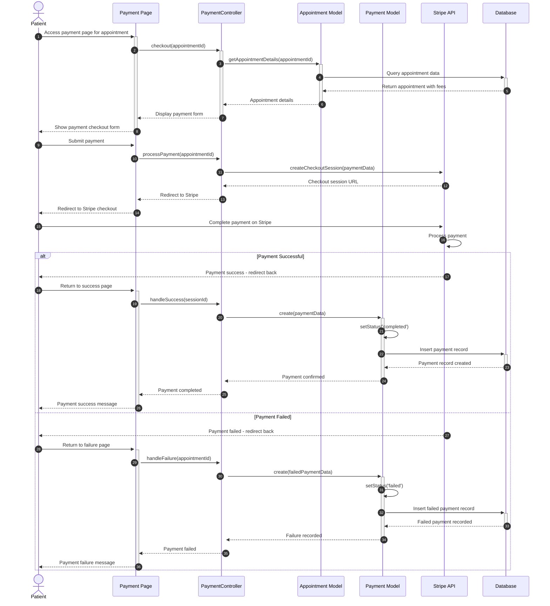

# Patient Payment Flow Sequence Diagram

This diagram visualizes the patient payment process for appointments in our clinic management system.

## Diagram Explanation

This simplified sequence diagram shows the core payment workflow:

### Key Components:
- **Patient**: User making payment for appointment
- **Payment Page**: Frontend payment interface
- **PaymentController**: Handles payment operations
- **Appointment Model**: Gets appointment details and fees
- **Payment Model**: Records payment transactions
- **Stripe API**: External payment processing
- **Database**: Data storage

### Simple Payment Flow:

1. **Payment Initialization**
   - Patient accesses payment page for appointment
   - System loads appointment details and fees
   - Payment form is displayed

2. **Payment Processing**
   - Patient submits payment
   - System creates Stripe checkout session
   - Patient is redirected to Stripe

3. **Payment Result**
   - **Success**: Payment record created with 'completed' status
   - **Failure**: Failed payment record created with 'failed' status
   - Patient receives appropriate confirmation message

### Payment Statuses:
- **completed**: Payment successful
- **failed**: Payment failed

This simplified flow focuses on the essential payment process without complex error handling or additional features. 
