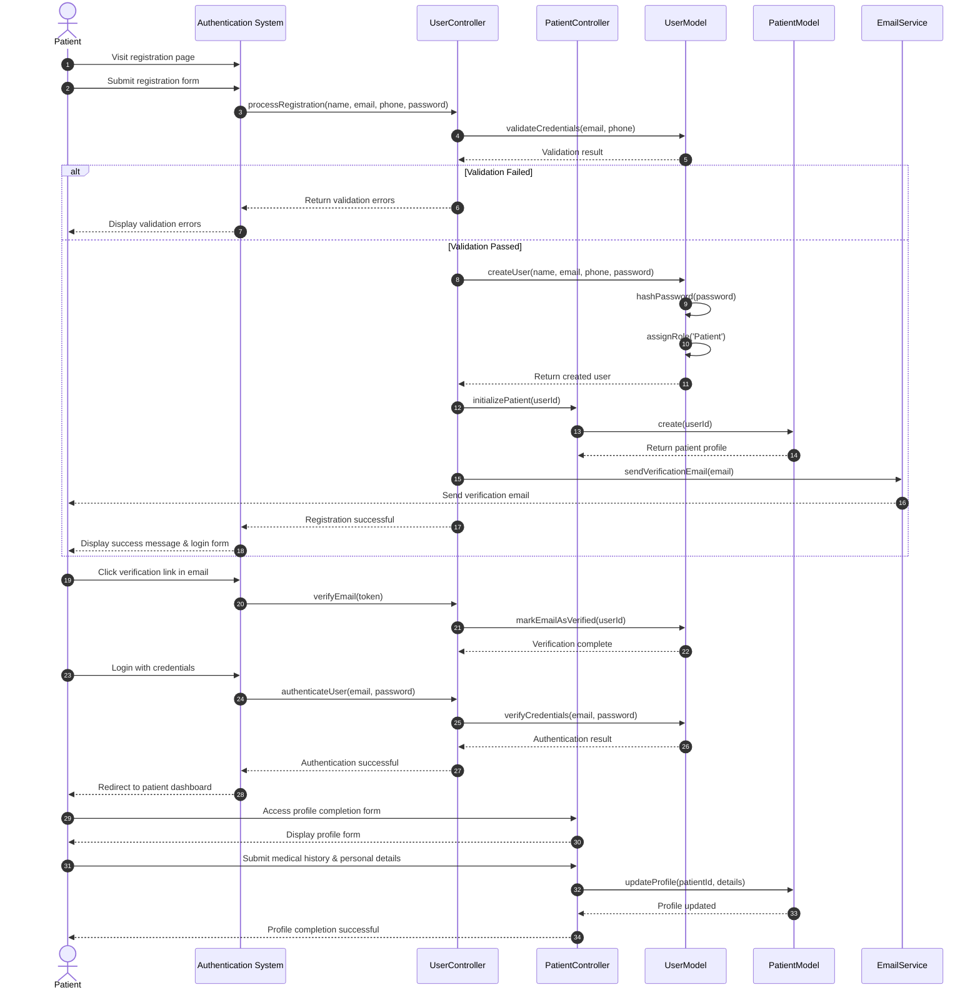

# Patient Registration Sequence Diagram

This diagram visualizes the patient registration and profile completion process in our clinic management system.

## Diagram Explanation

This sequence diagram illustrates the patient registration workflow in our clinic system, from account creation to profile completion:

### Key Steps:
1. **Initial Registration**
   - Patient visits the registration page
   - Patient fills out and submits the registration form with basic information
   - System validates the submitted credentials

2. **Account Creation**
   - System creates a new user account with the Patient role
   - A basic patient profile is initialized
   - A verification email is sent to the patient's email address
   - Patient is shown a success message and login form

3. **Email Verification**
   - Patient clicks on the verification link received in their email
   - System marks the email as verified

4. **First Login**
   - Patient logs in with their newly created credentials
   - System authenticates the user
   - Patient is redirected to their dashboard

5. **Profile Completion**
   - Patient accesses their profile completion form
   - Patient submits additional medical history and personal details
   - System updates the patient profile with the new information
   - Patient receives confirmation of successful profile completion

### Required Information for Registration:
- Basic personal information (name, email, phone number)
- Secure password
- Medical history (optional during registration, required later)
- Emergency contact information
- Blood type and allergies information (if applicable)

The system ensures that all patient accounts are properly verified and that patients can progressively complete their medical profiles, providing necessary information for effective healthcare services.
