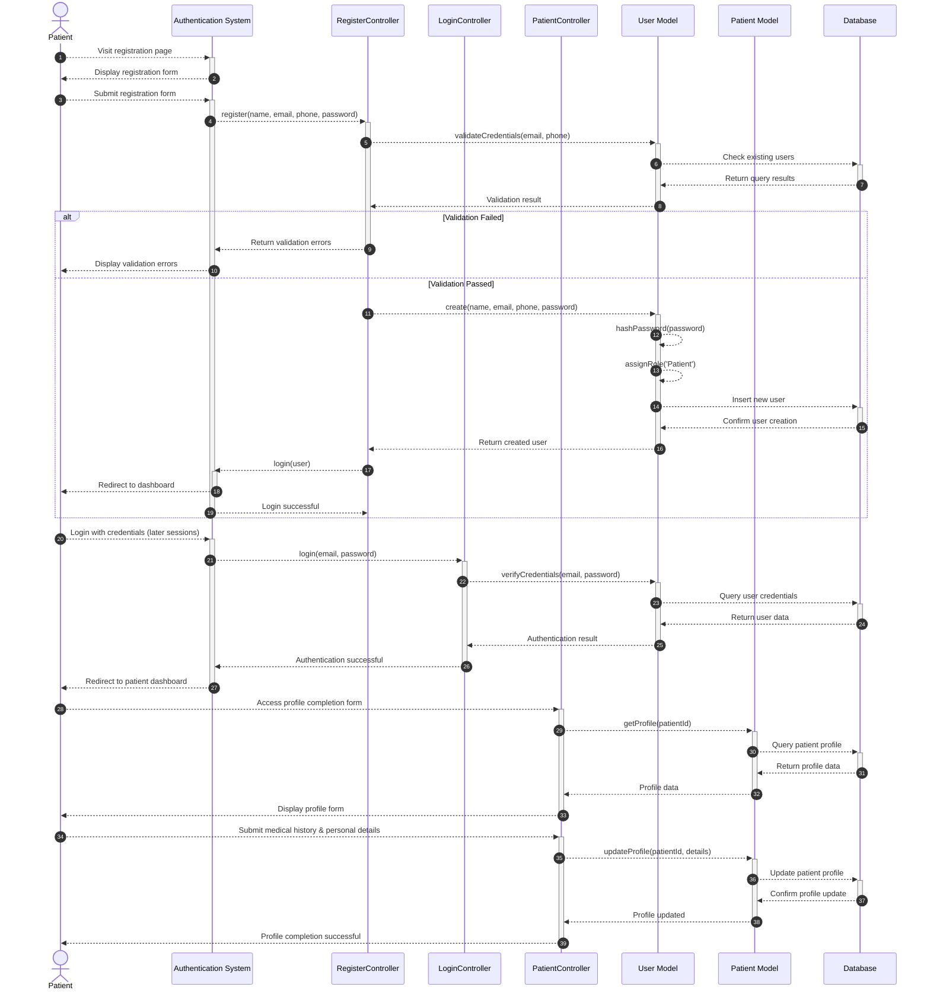

# Patient Registration Sequence Diagram

This diagram visualizes the patient registration and profile completion process in our clinic management system.

## Mermaid Symbols Legend

### Arrow Types (أنواع الأسهم):
- **`-->>`** : Dashed arrow (سهم منقط) - للرسائل غير المتزامنة أو المعلوماتية
- **`->>`** : Solid arrow (سهم متصل) - للرسائل المتزامنة أو الطلبات المباشرة
- **`-->>-`** : Dashed arrow with deactivation (سهم منقط مع إنهاء التفعيل) - إرجاع النتيجة وإنهاء العملية
- **`->>+`** : Solid arrow with activation (سهم متصل مع تفعيل) - بداية عملية جديدة

### Control Flow (تحكم في التدفق):
- **`alt`** : Alternative (البديل) - يمثل شرط if/else
- **`else`** : Otherwise (وإلا) - الحالة البديلة في الشرط
- **`end`** : End block (نهاية الكتلة) - إنهاء كتلة التحكم

### Activation Symbols (رموز التفعيل):
- **`+`** : Activate lifeline (تفعيل خط الحياة) - بداية معالجة في المكون
- **`-`** : Deactivate lifeline (إلغاء تفعيل خط الحياة) - انتهاء المعالجة في المكون

### Practical Examples من المخطط:
1. **`Patient-->>+AuthSystem`** : المريض يرسل طلب للنظام ويبدأ تفعيله
2. **`AuthSystem-->>-Patient`** : النظام يرد على المريض وينهي التفعيل
3. **`alt Validation Failed`** : إذا فشل التحقق من البيانات
4. **`else Validation Passed`** : وإلا إذا نجح التحقق من البيانات
5. **`User-->>User`** : عملية داخلية في المكون نفسه (self-call)

## Diagram Explanation

This sequence diagram illustrates the patient registration workflow in our clinic system, from account creation to profile completion:

### Key Components:
- **Patient**: The end user registering for the system
- **Authentication System**: Handles user authentication and session management
- **RegisterController**: Manages user registration operations (`Modules\Auth\Http\Controllers\RegisterController`)
- **LoginController**: Handles user authentication (`Modules\Auth\Http\Controllers\LoginController`)
- **PatientController**: Handles patient-specific functionality (`Modules\Patients\Http\Controllers\PatientController`)
- **User Model**: Data model for user entities (`Modules\Users\Entities\User`)
- **Patient Model**: Data model for patient entities (`Modules\Patients\Entities\Patient`)
- **Database**: Persistent data storage system

### Key Steps:
1. **Initial Registration**
   - Patient visits the registration page and receives the form
   - Patient fills out and submits the registration form with basic information
   - RegisterController validates the submitted credentials against existing database records

2. **Account Creation**
   - System creates a new user account with the Patient role in the database
   - Patient is automatically logged in and redirected to dashboard
   - No email verification is required in the current implementation

3. **Subsequent Logins**
   - Patient logs in with their credentials via LoginController
   - System authenticates the user against database records
   - Patient is redirected to their dashboard

4. **Profile Completion**
   - Patient accesses their profile completion form through PatientController
   - System retrieves existing profile data from the database
   - Patient submits additional medical history and personal details
   - System updates the patient profile in the database
   - Patient receives confirmation of successful profile completion

### Interactive Lifelines:
The diagram uses activation boxes (the vertical bars) to show when each component is actively processing requests, providing a clear visual representation of the system's interaction flow and component lifecycle during the registration process.

### Required Information for Registration:
- Basic personal information (name, email, phone number)
- Secure password
- Medical history (optional during registration, required later)
- Emergency contact information
- Blood type and allergies information (if applicable)

### Note:
The current implementation does not include email verification. Users are automatically logged in after successful registration and can immediately access the system.
