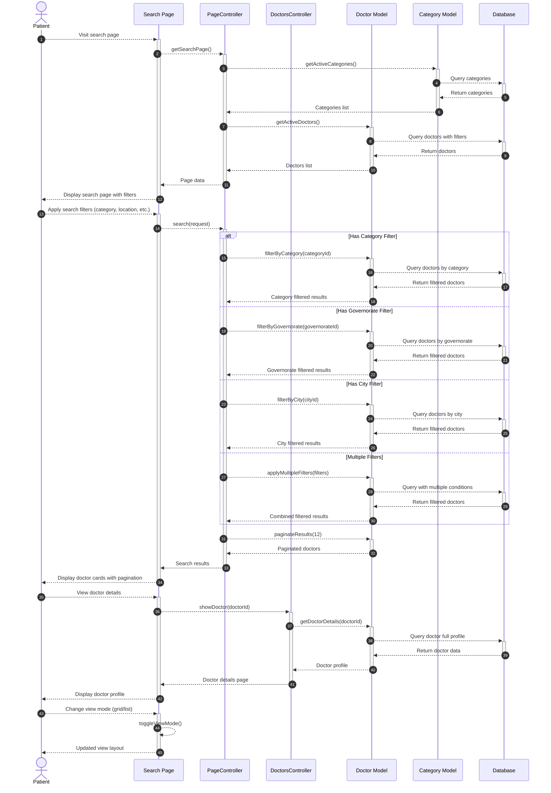

# Patient Search Doctors Sequence Diagram

This diagram visualizes the patient search doctors process in our clinic management system.

## Mermaid Symbols Legend

### Arrow Types:
- **`-->>`** : Dashed arrow - للرسائل غير المتزامنة أو المعلوماتية
- **`->>`** : Solid arrow - للرسائل المتزامنة أو الطلبات المباشرة
- **`-->>-`** : Dashed arrow with deactivation - إرجاع النتيجة وإنهاء العملية
- **`->>+`** : Solid arrow with activation - بداية عملية جديدة

### Control Flow:
- **`alt`** : Alternative - يمثل شرط if/else
- **`else`** : Otherwise - الحالة البديلة في الشرط
- **`end`** : End block - إنهاء كتلة التحكم

### Activation Symbols:
- **`+`** : Activate lifeline - بداية معالجة في المكون
- **`-`** : Deactivate lifeline - انتهاء المعالجة في المكون

### Practical Examples:
1. **`Patient-->>+SearchPage`** : المريض يطلب صفحة البحث
2. **`SearchPage-->>-Patient`** : الصفحة ترد على المريض وتنهي التفعيل
3. **`alt Has Category Filter`** : إذا كان هناك فلتر للتخصص
4. **`else Has Governorate Filter`** : وإلا إذا كان هناك فلتر للمحافظة
5. **`else Has City Filter`** : وإلا إذا كان هناك فلتر للمدينة
6. **`Doctor-->>Doctor`** : عملية داخلية في نموذج الطبيب

## Diagram Explanation

This sequence diagram illustrates the patient search doctors workflow in our clinic system:

### Key Components:
- **Patient**: The end user searching for doctors
- **Search Page**: The frontend search interface (`Modules\Doctors\Resources\views\search.blade.php`)
- **PageController**: Handles search requests (`App\Http\Controllers\PageController`)
- **DoctorsController**: Manages doctor-related operations (`Modules\Doctors\Http\Controllers\DoctorsController`)
- **Doctor Model**: Data model for doctor entities (`Modules\Doctors\Entities\Doctor`)
- **Category Model**: Data model for medical specialties (`Modules\Specialties\Entities\Category`)
- **Database**: Persistent data storage system

### Key Steps:
1. **Initial Search Page Load**
   - Patient visits the search page
   - System loads available categories and active doctors
   - Search filters and initial results are displayed

2. **Apply Search Filters**
   - Patient applies various filters (category, location, experience, fees)
   - System processes filters through different conditional paths
   - Database queries are executed based on filter combinations

3. **Display Results**
   - Filtered results are paginated (12 doctors per page)
   - Doctor cards are displayed with essential information
   - Pagination controls are provided for navigation

4. **Doctor Details**
   - Patient can view detailed doctor profiles
   - System retrieves complete doctor information
   - Full profile page is displayed

5. **View Mode Toggle**
   - Patient can switch between grid and list views
   - Frontend handles view mode changes without server requests

### Available Filters:
- **Category/Specialty**: Filter by medical specialization
- **Governorate**: Filter by governorate (المحافظة)
- **City**: Filter by city (المدينة)
- **Status**: Only active doctors with complete profiles are shown

### Interactive Features:
- Real-time filtering without page reload
- Responsive grid/list view toggle
- Pagination for large result sets
- Doctor profile modal/detail pages

The system ensures that only active doctors with complete profiles are displayed to patients, providing a reliable search experience. 